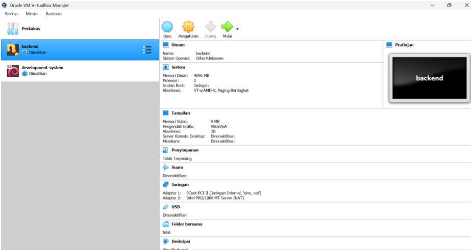
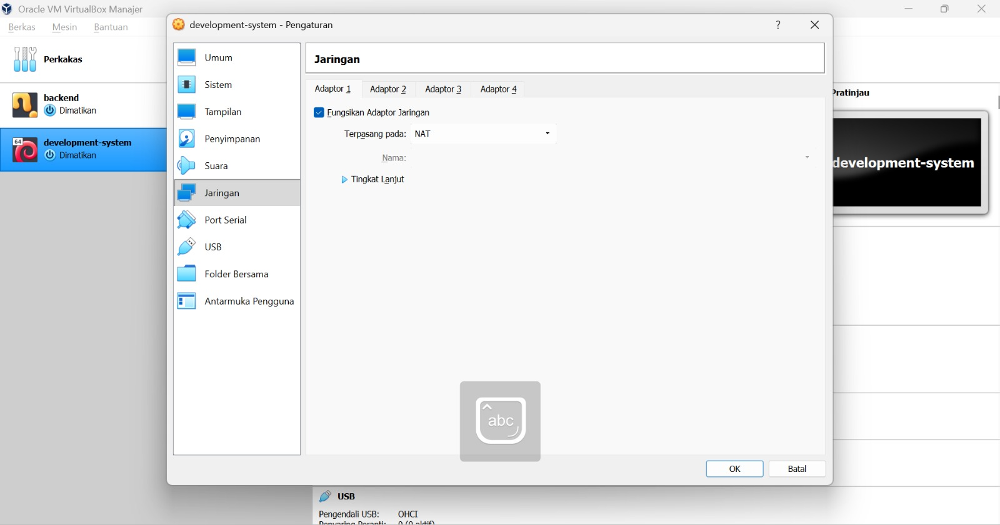
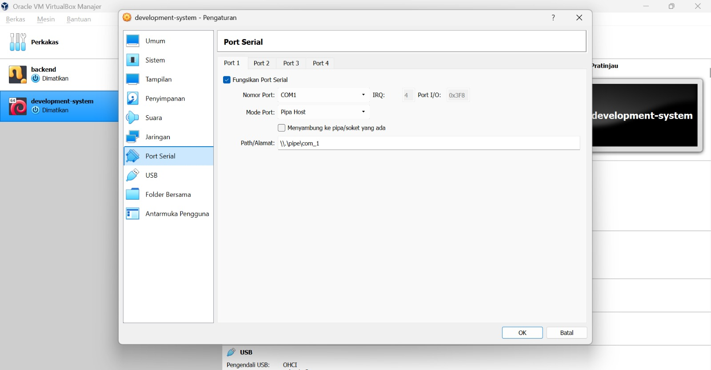
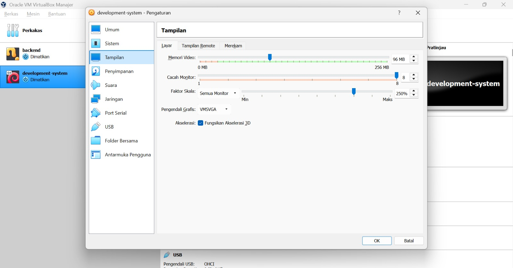
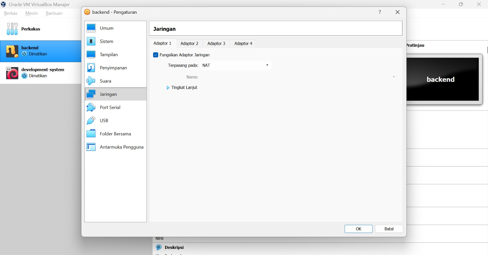
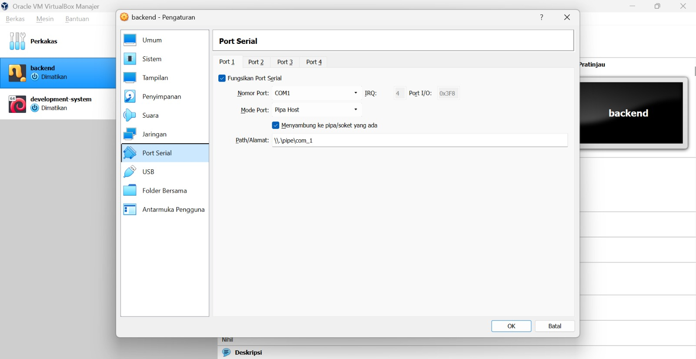
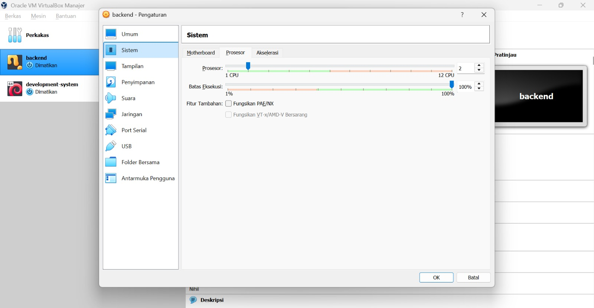
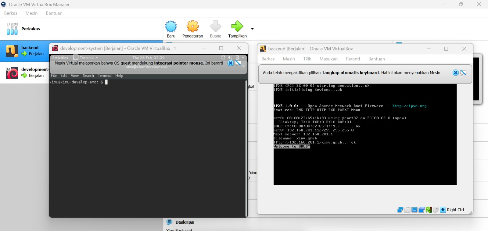

# <h1 align="center">Laporan Praktikum Modul 2    Instalasi Xinu </h1>

SHILFI HABIBAH - 2311104002

## A. Dasar Teori

### a. File .OVA
File OVA (Peralatan Virtual Terbuka) adalah jenis berkas yang digunakan dalam virtualisasi sistem. Paket-paket ini memungkinkan Anda mendistribusikan dan menerapkan mesin virtual dengan mudah di berbagai hypervisor seperti VirtualBox, VMware, dan lainnya. File OVA terutama digunakan untuk mendistribusikan dan menyebarkan mesin virtual dengan cara yang sederhana. File-file ini memungkinkan Anda untuk berbagi lingkungan kerja yang lengkap tanpa perlu mengonfigurasinya dari awal, memfasilitasi replikasi sistem yang tepat di berbagai komputer atau lingkungan.

## B. Guided

### 1. Import dan Setting Development-System VM

Setelah instalasi selesai, import file development-system.ova pada VirtualBox.

Langkah - langkah setting :
- Pilih "Setting"
- Masuk ke menu "Network" dan ubah setting jaringan menjadi "NAT" (  )
- Masuk ke menu "Serial Ports" dan ubah setting pada Path/Address jadi '\\.\pipe\com_1' (  )
- Masuk ke menu "Display" dan centang 'Enable 3D Acceleration' (  )
- setelah selesai semua setting klik ok untuk menyimpan perubahan setting 

### 2. Import dan Setting Backend VM

Setelah instalasi selesai, import file development-system.ova pada VirtualBox.

Langkah - langkah setting : 
- Pilih "Setting"
- Masuk ke menu "Network" dan ubah setting jaringan menjadi "NAT" (  )
- Masuk ke menu "Serial Ports" dan ubah setting pada Path/Address harus sama dengan development-system (  )
- Mask ke menu "Sistem" ubah setting CPU jadi 2 (  )
- setelah selesai semua setting klik ok untuk menyimpan perubahan setting

### 3. Menjalankan Xinu

Langkah - langkah run:
- Run development-system , nanti akan loading dan proses berjalan sampai muncul tampilan awal xinu , kemudian kita masukan sandi “xinurocks” sampai muncul seperti ss an diatas
- Run backend juga setelah proses loading selesai juga tampil seperti ss an diatas

## C. Referensi

1. https://www.polimetro.com/id/apa-itu-file-ova/
