# <h1 align="center">Laporan Praktikum Modul 4    Membaca Source Code Xinu </h1>

SHILFI HABIBAH - 2311104002

## A. Dasar Teori

### a.  Paradigma Embedded pada Xinu
Xinu ditujukan untuk sistem embedded, oleh karena itu Xinu mengikuti paradigma cross-development. Pada paradigma cross-development, developer (programmer) akan menggunakan komputer standar pada umumnya dan memakai sistem operasi biasa seperti Linux atau Windows.
### b. Bahasa Pemrograman pada Xinu
Xinu ditulis dalam bahasa C, sama seperti banyak sistem operasi lainnya (Unix, Linux, macOS, dll).
### c. Organisasi Source Code Xinu
Struktur direktori Xinu terdiri dari beberapa folder penting, antara lain:
- `/compile` → proses kompilasi
- `/system` → kernel Xinu
- `/include` → header file
- `/shell` → perintah-perintah shell
- `/device` → driver perangkat
- `/lib` → fungsi library
- `/net` → fungsi jaringan
Struktur ini membantu pengorganisasian kode agar modular dan mudah dikembangkan.
### d. File Utama pada Xinu
Beberapa file penting dalam Xinu antara lain:
- `kernel.h` → deklarasi kernel
- `process.h` → struktur proses
- `conf.h` dan `conf.c` → konfigurasi sistem
- `initialize.c` → inisialisasi sistem

## B. Guided

### Instalasi dan Eksplorasi Source Code Xinu dengan Sourcetrail
Langkah - langkah : 
1. Download file source code xinu yang tersedia pada attempt jurnal praktikum di LMS 
2. Setelah di download extract file lalu Jalankan SourceTrail 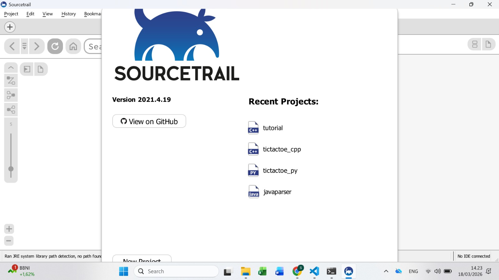
3. Seletah itu buat new poroject dengan name project NIM_Nama terus location e bebas  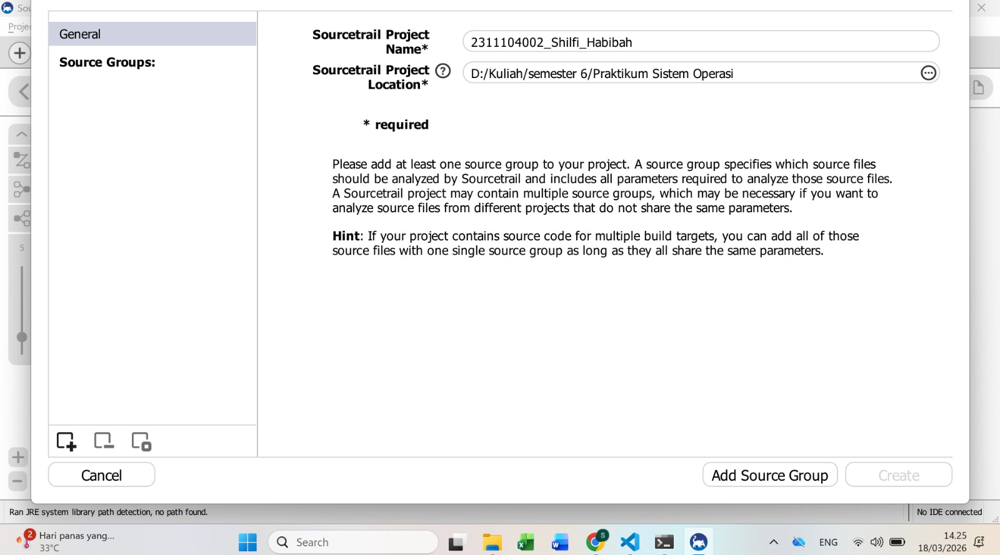
4. Klik Add Spurce Grup bagian kanan bawah akan muncul type bahasa yang akan digunakan, kita akan memilih C terus klik Empty C Source Group 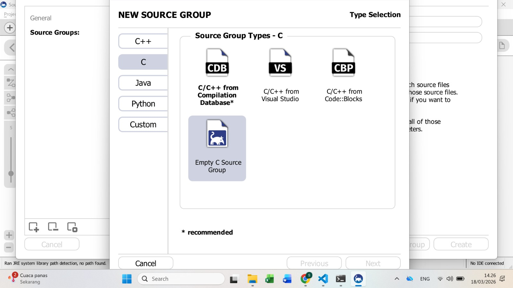
5. Setelah itu akan muncul tampilan lagi ke menu Files & Directories to Index klik tanda + lalu klik titik 3 , kemudian masuk dan import ke vile xinu-vbox yang sebelumnya sudah di download dan di extract 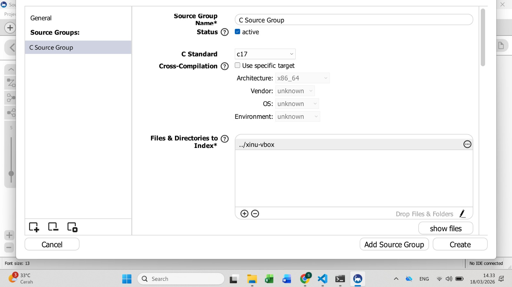
6. Masih di halaman yang sama , scroll ke bagian Source File Extentions tambahkan .S 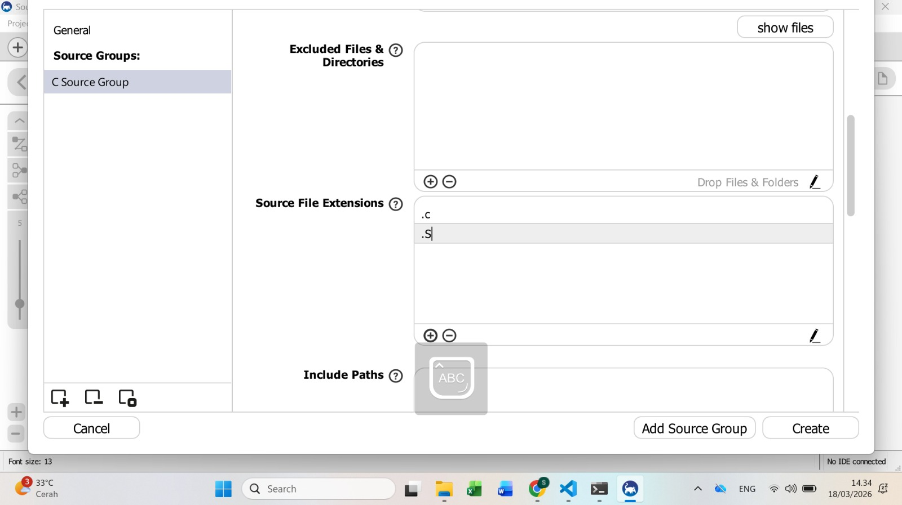
7.  Masih di halaman yang sama , scroll ke bagian Include Paths klik auto-detect lalu start detect include paths nya, kemudian sistem akan loading sampai file masuk 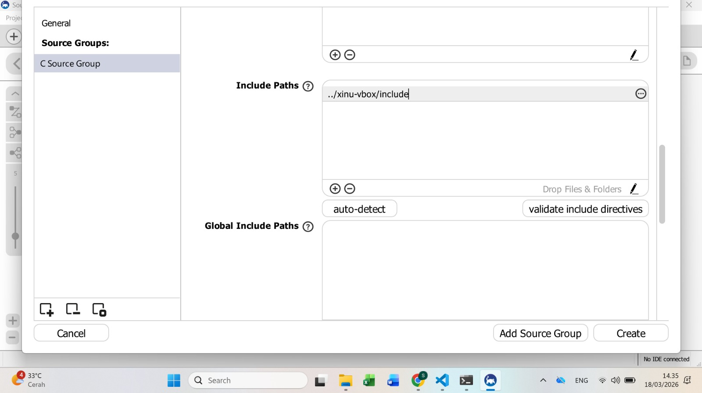 
8. Kemudian klik Add Source Grup , muncul tampilan baru di Sourcetrail 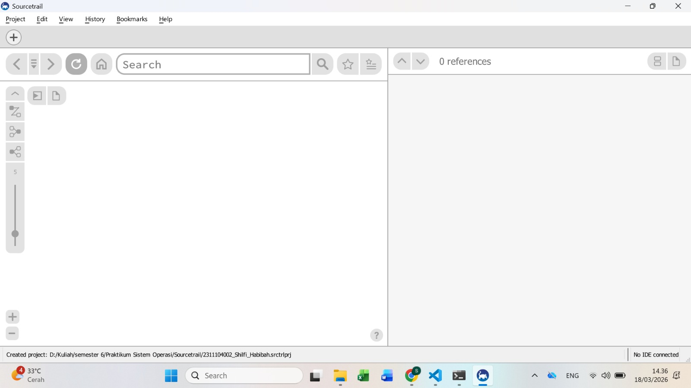
9. Lalu muncul Indexing Files kita klik start , sampai ada keterangan finish 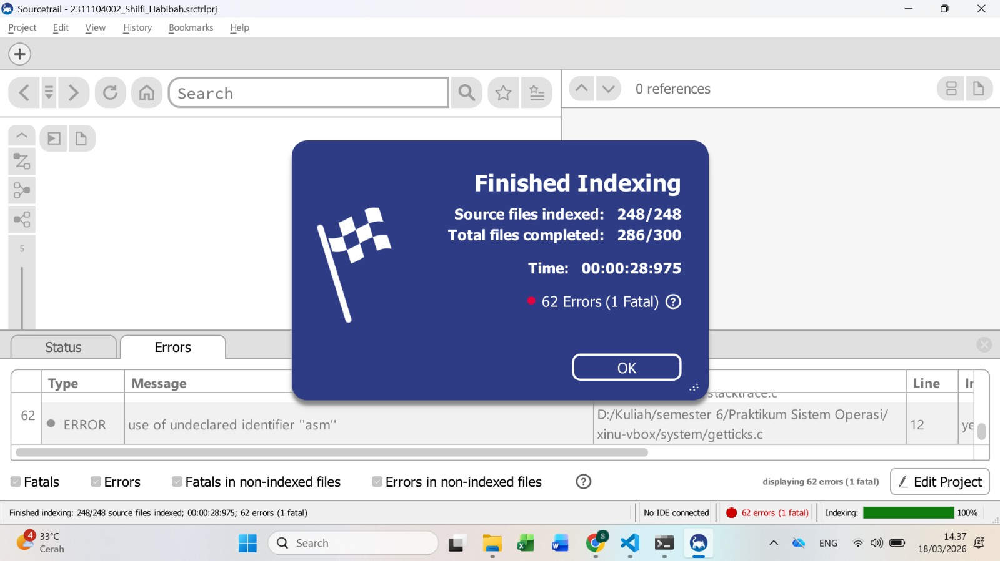 
10. Setelah itu muncul tampilan otomatis yaitu overview 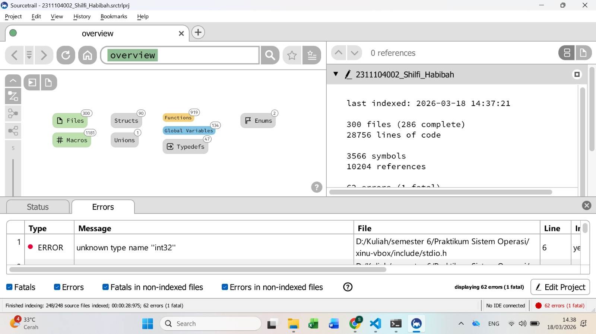
11. Kita coba search contoh main.c 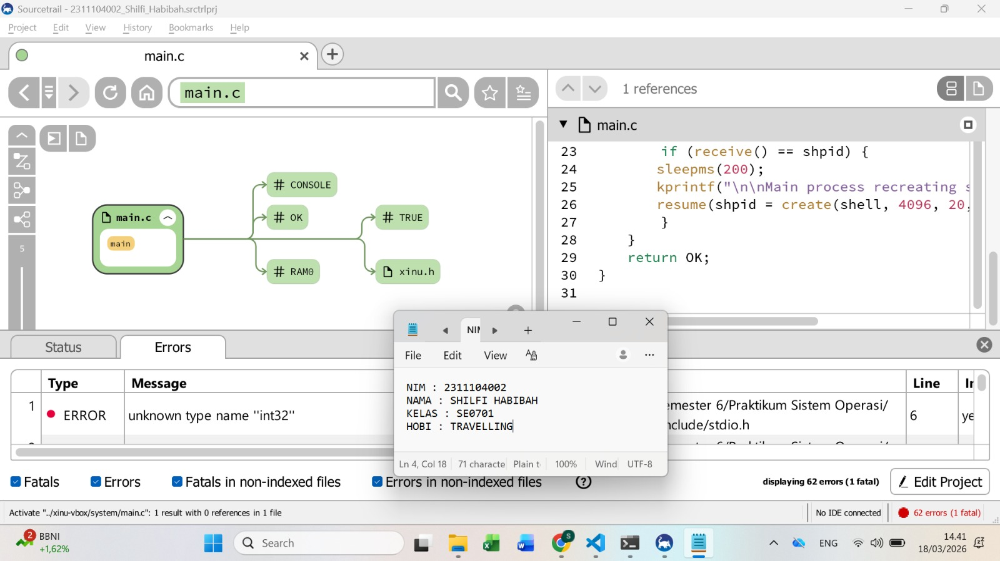

## C. Unguided

1. Apa nama image yang dihasilkan setelah melakukan kompilasi pada Xinu? Berapa ukuran file tersebut? Ada pada folder apa file image tersebut?
Jawab : 
Nama file image hasil kompilasi adalah **xinu.elf** , file tersebut berada pada folder **/compile** dan ukuran file bervariasi tergantung sistem, biasanya sekitar beberapa ratus KB. 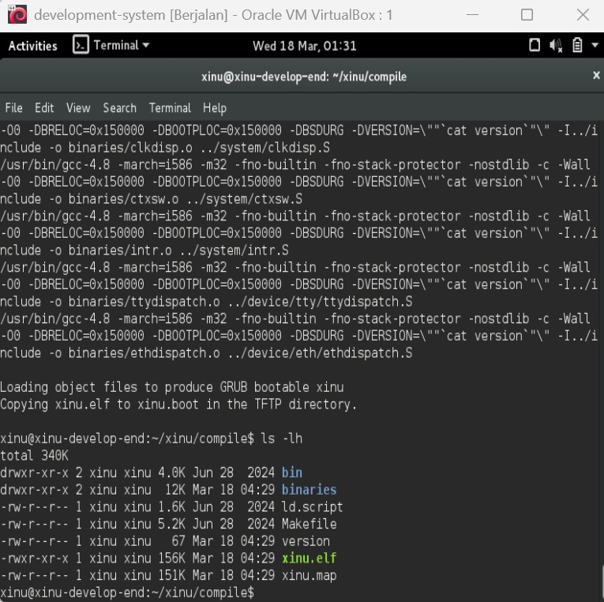

2. Carilah struktur data dari proses pada Xinu OS. Struktur data proses ada pada file apa? Informasi apa saja yang disimpan dalam struktur data tersebut? 
Jawab : 
Struktur data proses pada Xinu terdapat pada file **process.h** (di folder `/include`).  
Struktur ini biasanya berupa `struct procent` yang menyimpan informasi seperti:
- PID (Process ID)
- State proses
- Priority
- Stack pointer
- Stack size
- Name proses
- Message
- Parent process
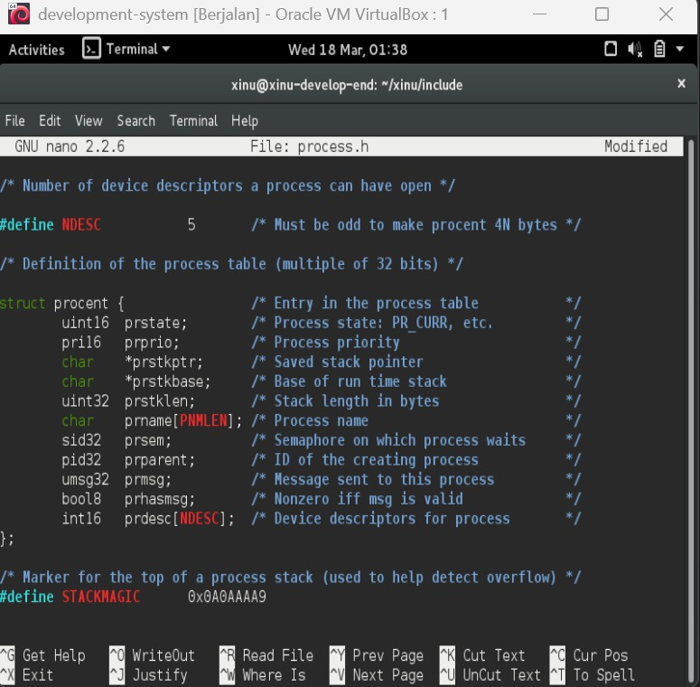

3.  Modifikasi Welcome Banner Xinu
### a. Carilah file yang menyimpan banner Xinu! Hint: file berekstensi .h pada direktori xinu/include
Jawab:  
File yang menyimpan banner Xinu terdapat pada file `shell.h` di direktori `/include`. File ini berisi string banner yang akan ditampilkan pada saat sistem dijalankan.
Untuk melihat isi file tersebut digunakan perintah: cd xinu/include lalu nano shell.h
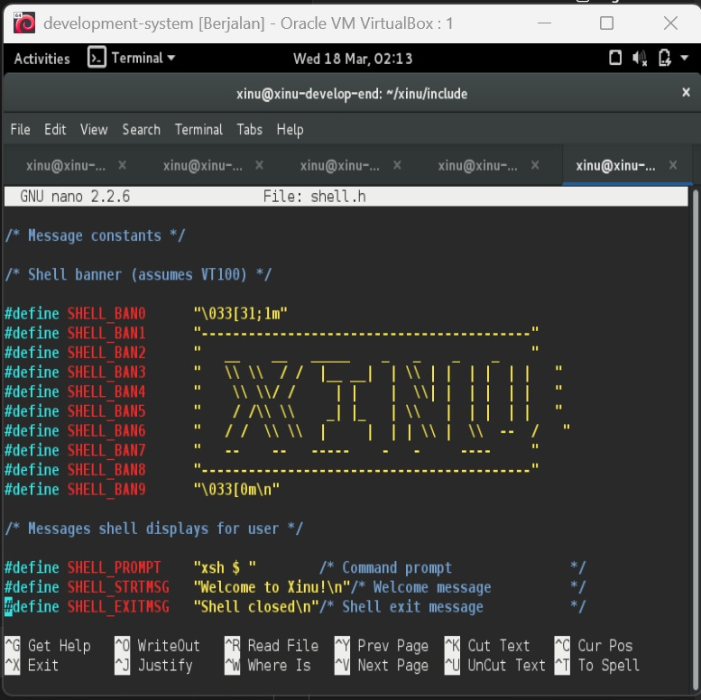
### b. Carilah file yang menyimpan banner Xinu! Hint: file berektensi .c pada direktori xinu/shell
Jawab:  
Untuk mengetahui file yang menampilkan banner Xinu, dilakukan dengan membuka file shell.c pada direktori /shell menggunakan perintah: cd xinu/shell lalu nano shell.c
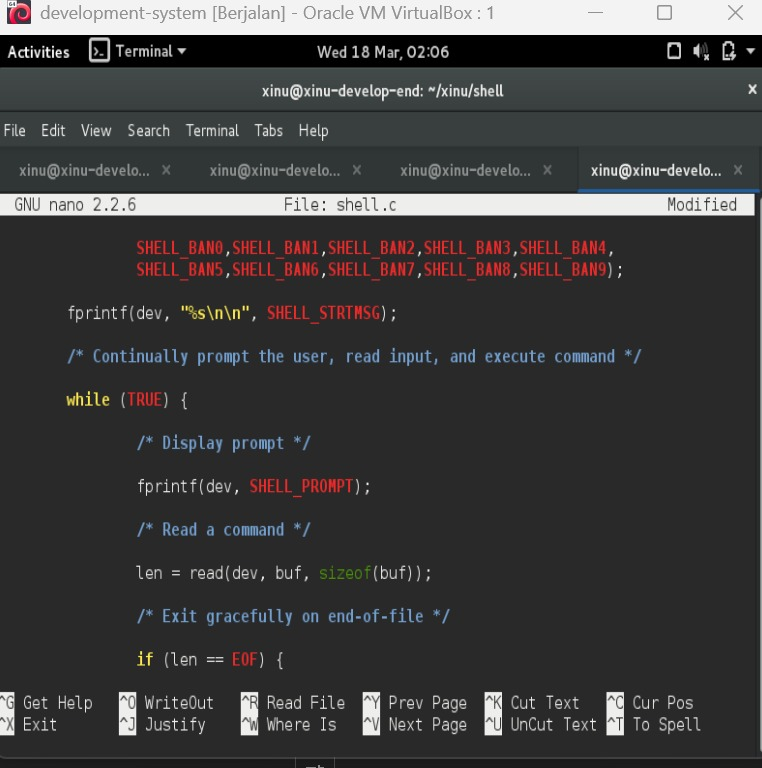
Pada file tersebut ditemukan bahwa banner Xinu ditampilkan menggunakan fungsi fprintf yang mencetak string SHELL_STRMSG ke laya
### c. Modifikasi welcome banner Xinu
Modifikasi banner Xinu dilakukan dengan mengubah isi file `shell.h` yang berada pada direktori `/include`. File ini berisi string banner utama (`SHELL_STRMSG`) serta tampilan ASCII art (`SHELL_BAN0` hingga `SHELL_BAN9`).
- Langkah yang dilakukan adalah sebagai berikut: cd xinu/include lalu nano shell.h 
- ubah : 
    #define SHELL_BAN1 "------------ SHILFI HABIBAH ------------"
    #define SHELL_BAN8 "------------ 2311104002 ----------------"
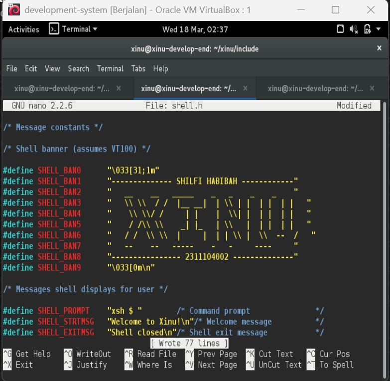
### Compile dan menjalankan xinu 
- Setelah modifikasi selesai dilakukan, langkah berikutnya adalah melakukan proses kompilasi ulang dan menjalankan sistem Xinu untuk melihat hasil perubahan banner.
- Langkah-langkah yang dilakukan:
    cd ../compile
    make clean
    make
    sudo minicom
- Setelah itu, virtual machine backend dijalankan kembali agar sistem Xinu dapat dieksekusi. Hasilnya, banner yang ditampilkan pada layar telah berubah sesuai dengan modifikasi yang telah dilakukan, yaitu menampilkan teks tambahan serta nama dan NIM pada bagian ASCII banner.
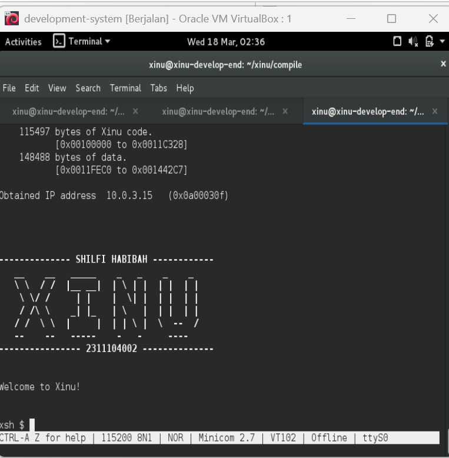

## D. Referensi

1. https://medium.com/@itafatmawati7527/membaca-source-code-xinu-03b93019c5a5
2. https://medium.com/@alfreda1808/membaca-source-code-xinu-53f35a391a78

