# <h1 align="center">Laporan Praktikum Modul 5    Eksplorasi Proses Xinu </h1>

SHILFI HABIBAH - 2311104002

## A. Dasar Teori

### a.  Proses
Sistem operasi menyimpan semua informasi mengenai semua proses yang berjalan pada struktur data yang disebut sebagai process table. Sebuah proses direpresentasikan sebagai sebuah entri dalam process table tersebut. Entri pada process table akan dibuat pada saat proses diciptakan dan entri pada process table akan dihapus pada saat proses diterminasi.
### b. source code utama pada Xinu
Beberapa source code utama untuk menangani proses adalah:
- ./include/proses.h yang berisi konfigurasi setiap proses pada Xinu.
- ./system/create.c untuk membuat proses.
- ./system/kill.c untuk terminasi proses.
- /system/resume.c untuk resume proses

## B. Guided

### Eksplorasi Proses Xinu dengan Sourcetrail
Langkah - langkah : 
1. Masuk ke project di modul sebelumnya , lalu searching "process.h" 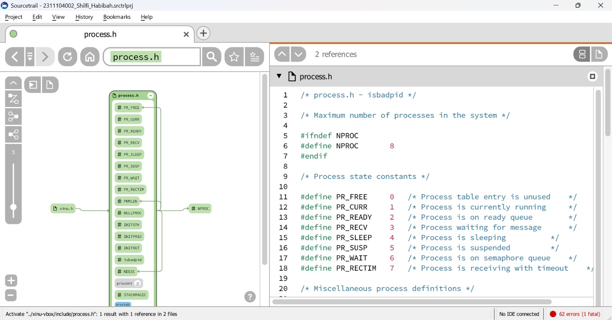
2. Scroll ke bawah kode e klik procent 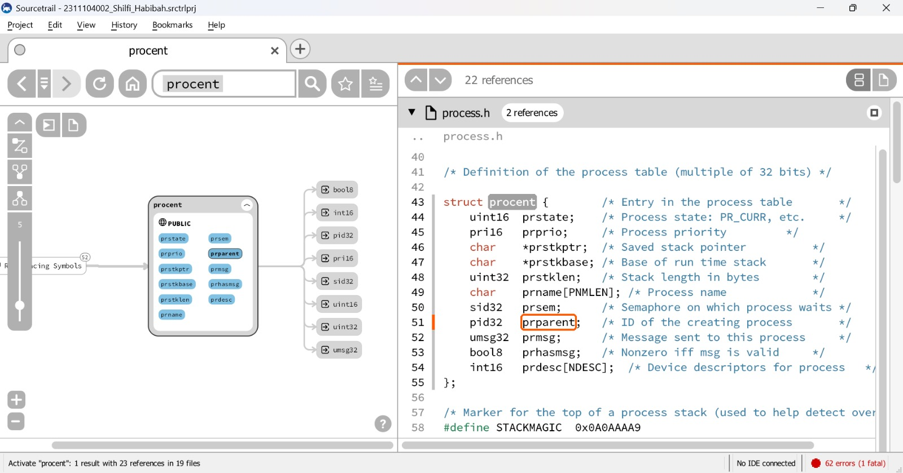
3.  Scroll ke bawah kode e klik procent 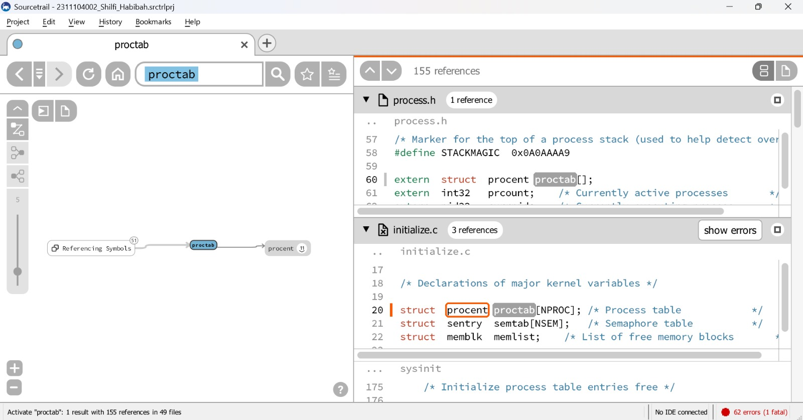

## C. Unguided

### 1. Jawablah pertanyaan berikut ini:
a. Berapa banyaknya maksimum proses yang ada pada Xinu?

b. Berapa maksimal panjang nama suatu proses pada Xinu?

c. Berapa nilai prioritas awal pada saat proses dibuat?

d. Ada berapa total state pada Xinu? Sebutkan!

Jawab :  
a. 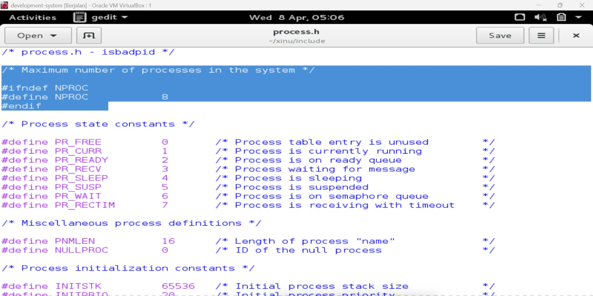
Gambar tersebut menunjukan jumlah maksimum proses yang dapat dijalankan dalam sistem Xinu. Secara default, nilai NPROC adalah 8, artinya hanya delapan proses yang bisa aktif dalam satu waktu, termasuk proses utama dan proses null. Nilai ini bisa diubah sesuai kebutuhan sistem. 
b. 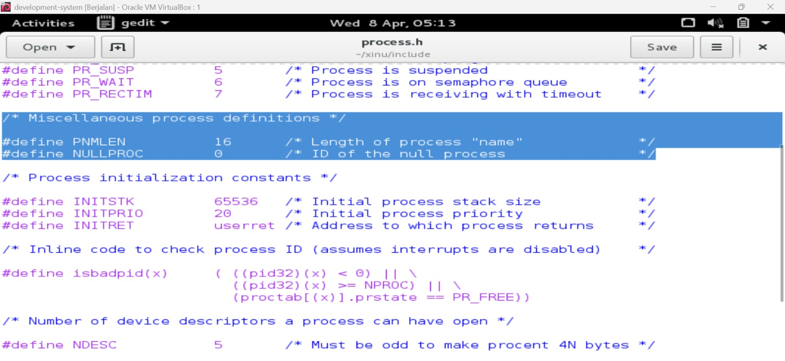
- Maksimal panjang nama proses pada Xinu adalah 16 karakter.
- PNMLEN menentukan panjang maksimum nama proses.
- NULLPROC adalah proses khusus yang selalu berjalan ketika tidak ada proses lain yang aktif.
Dengan kata lain, NULLPROC memastikan CPU tidak pernah benar-benar idle.
c. 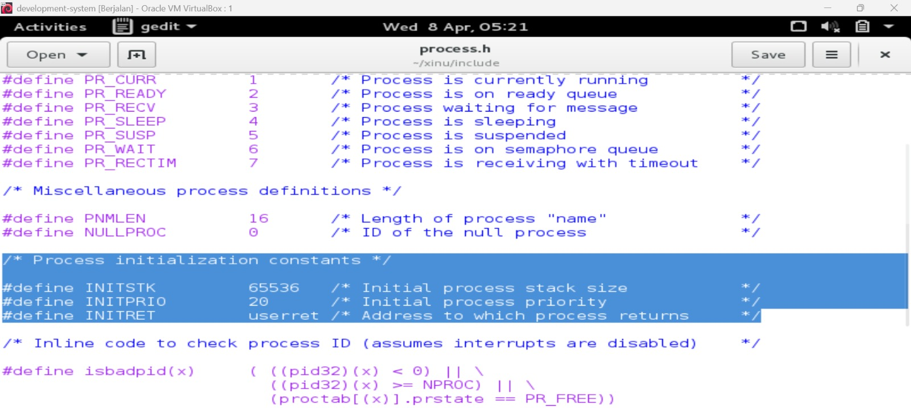
- Nilai prioritas awal proses saat dibuat adalah 20.
- Nilai-nilai di atas digunakan saat proses baru dibuat. Mereka menentukan ukuran stack yang digunakan proses, prioritas awalnya, dan alamat fungsi yang akan dipanggil ketika proses selesai dieksekusi.
d. 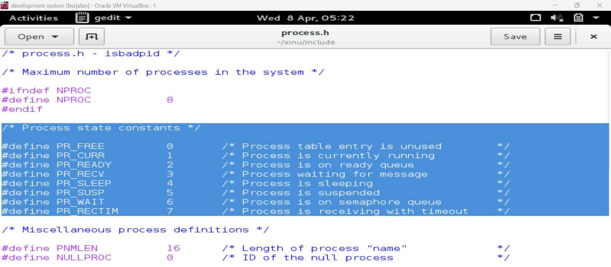
- Total state pada Xinu ada 7, yaitu PR_FREE, PR_CURR, PR_READY, PR_RECV, PR_SLEEP, PR_SUSP, dan PR_WAIT.
- Konstanta-konstanta ini mendefinisikan status dari setiap proses yang ada dalam sistem. Status ini disimpan di tabel proses dan digunakan oleh kernel untuk menentukan tindakan berikutnya terhadap proses tersebut.

note : masuk ke folder xinu lalu ketik "gedit include/process.h" 

### 2. Perintah ps adalah perintah untuk menampilkan statistik process yang berjalan. Source code dari ps tersimpan pada file xsh_ps.c. Carilah file tersebut dan beri komentar pada 20 baris terakhir di source code tersebut!

Jawab :  

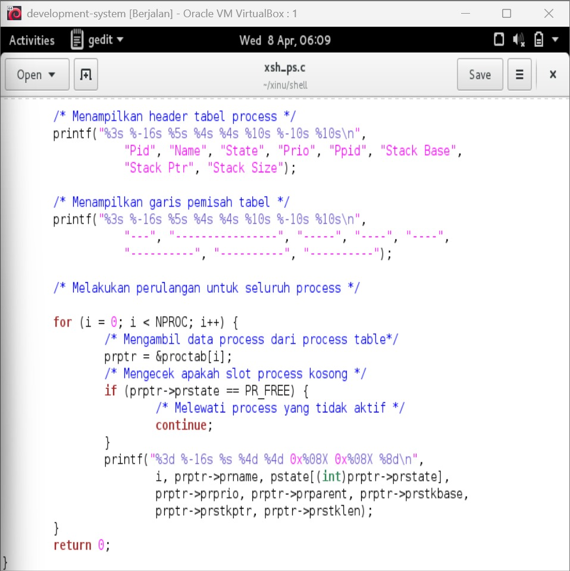
Komentar ditambahkan pada 20 baris terakhir file xsh_ps.c untuk menjelaskan fungsi setiap bagian kode pada implementasi perintah ps. Bagian yang diberi komentar meliputi pencetakan header tabel, perulangan process table, pengecekan state proses, dan pencetakan informasi setiap proses. Penambahan komentar bertujuan agar source code lebih mudah dipahami.
Langkah pengerjaan : 
1. Membuka file xsh_ps.c pada folder xinu/shell/.
2. ketik cd ~/xinu/shell
3. Tambahkan komentar sebelum blok / baris terkait
4. Klik save

### 3. Ubahlah perintah ps (source code: xsh_ps.c) pada Xinu sehingga menampilkan informasi tambahan berupa kolom yang berisi total message yang ada pada proses seperti gambar di bawah ini:

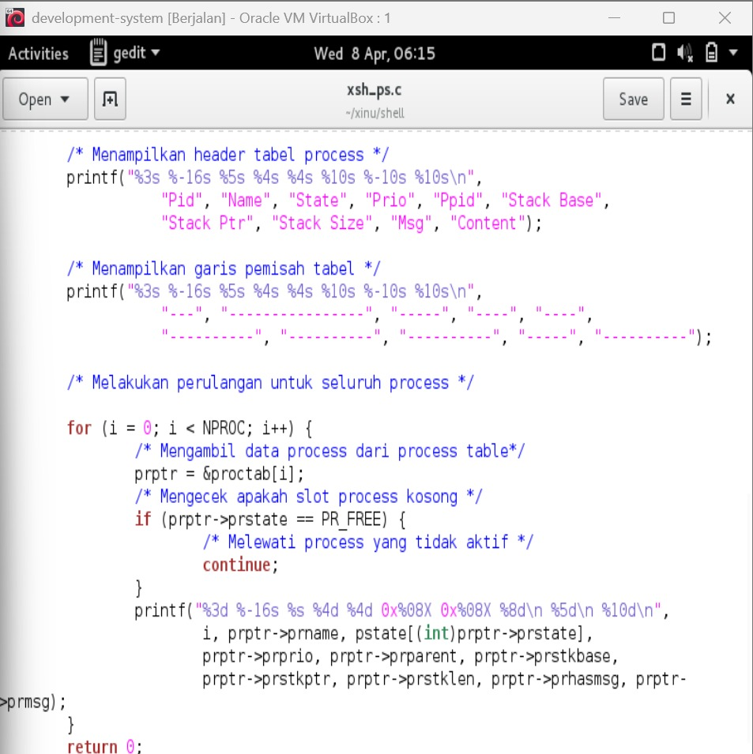
Kolom Msg adalah banyaknya pesan yang ada dalam proses.
Kolom Content adalah isi dari pesan tersebut.
Langkah pengerjaan:
- Modifikasi source code pada file xsh_ps.c
- Kompilasi ulang Xinu dengan perintah seperti pada modul sebelumnya 
- Jalankan Backend VM 
- Setelah sistem berjalan, jalankan perintah $ps. Pastikan hasilnya sesuai dengan contoh output pada gambar yang diberikan.
- Screenshot source kode dan output akhir hasil modifikasi

Jawab:  

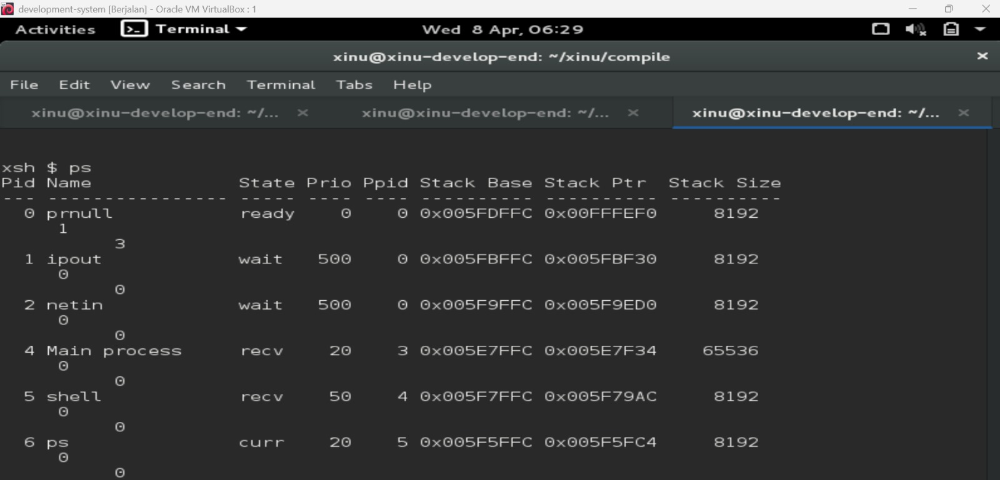
Perintah ps dimodifikasi dengan menambahkan kolom Msg dan Content pada output tabel proses. Kolom Msg menampilkan status keberadaan pesan pada proses melalui atribut prhasmsg, sedangkan kolom Content menampilkan isi pesan melalui atribut prmsg. Setelah dilakukan kompilasi ulang, output perintah ps berhasil menampilkan informasi tambahan tersebut.

Langkah pengerjaan : 
1. Membuka file xsh_ps.c pada folder xinu/shell/.
2. cari bagian printf ubah header tabel, garis separator, Tambah Data Msg & Content di Output Process dan Tambah varibel output
3. Lalu save 
4. ketik cd xinu/compile
5. ketik make clean , make , sudo minicom
6. ketik ps 

### 4. Ubahlah perintah uptime pada Xinu sehingga menampilkan lamanya Xinu sejak booting hanya dalam satuan menit.
Langkah pengerjaan:
- Modifikasi source code pada file xsh_uptime.c
- Kompilasi ulang Xinu dengan perintah seperti pada modul sebelumnya 
- Jalankan Backend VM 
- Setelah sistem berjalan, jalankan perintah $uptime. Pastikan hasilnya sesuai dengan contoh output yang diinginkan
- Screenshot source kode dan output akhir hasil modifikasi

Jawab : 

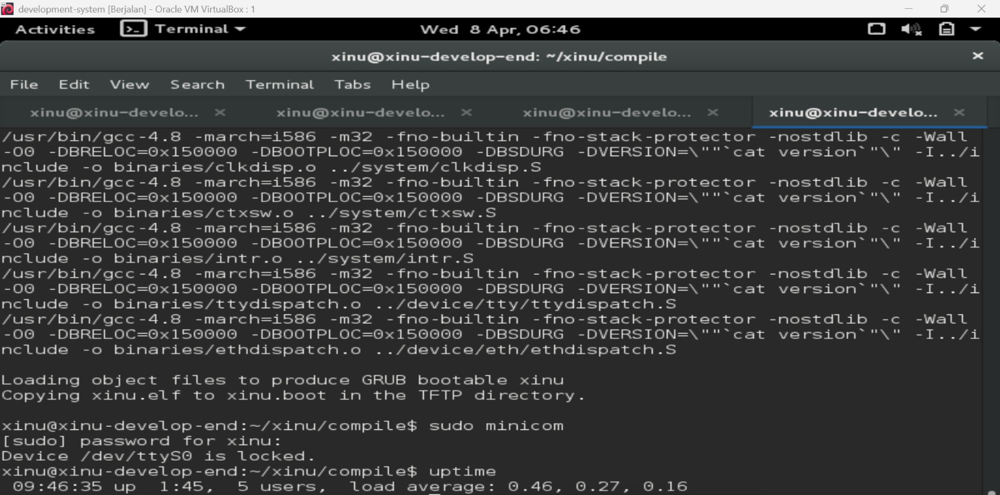
Perintah uptime dimodifikasi agar hanya menampilkan waktu aktif sistem dalam satuan menit. Perhitungan dilakukan dengan membagi nilai clktime dengan 60 untuk memperoleh total menit sejak sistem booting. Output kemudian ditampilkan hanya dalam format menit sesuai ketentuan praktikum.

Langkah pengerjaan :
1. Membuka file xsh_uptime.c pada folder xinu/shell/.
2. ketik gedit xsh_uptime.c
3. Cari Bagian Perhitungan Uptime biasane secs = clktime;
4. Edit seperti pada gambar 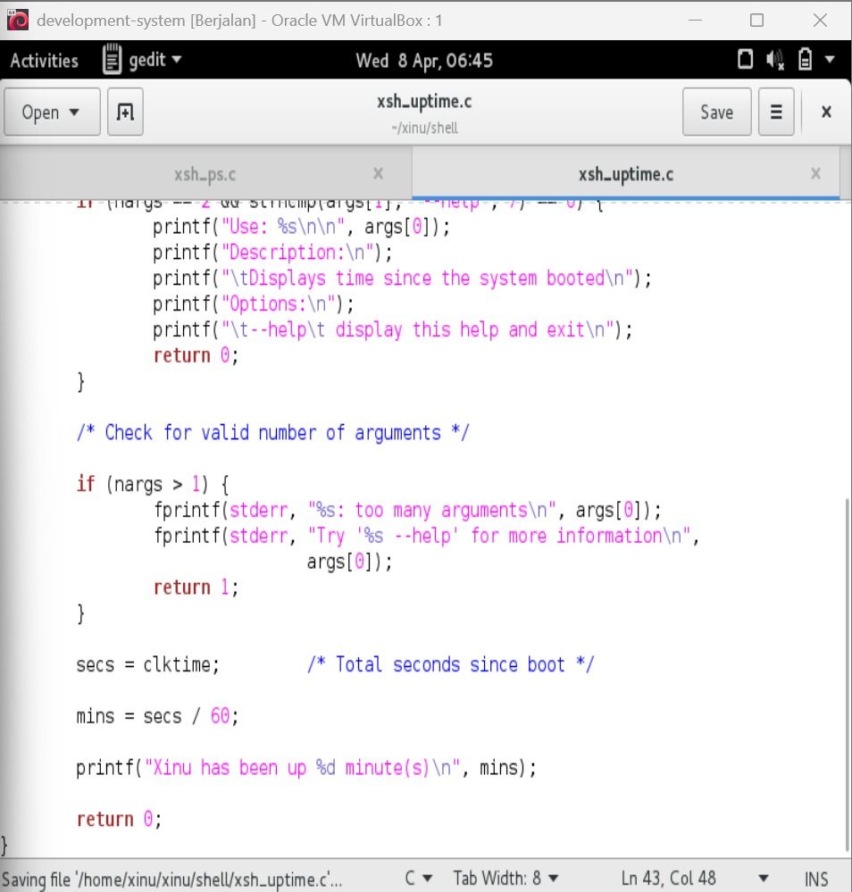
5. save 
6. compile ulang dari cd xinu/compile sampe sudo minicom
7. ketik uptime

## D. Referensi

1. https://id.scribd.com/doc/200716687/Modul-Sistem-Operasi

