# <h1 align="center">Laporan Praktikum Modul 6    Proses Sekuensial dan Konkuren </h1>

SHILFI HABIBAH - 2311104002

## A. Dasar Teori

### a. Sekuensial
Rangkaian logika sekuensial adalah rangkaian digital yang output-nya bergantung tidak hanya pada keadaan input saat ini, tetapi juga pada keadaan output sebelumnya.
### b. Konkurensi
Konkurensi adalah salah satu konsep fundamental dalam sistem operasi yang berperan penting dalam mengelola efisiensi dan pemanfaatan sumber daya sistem.

## B. Guided

### Eksplorasi Proses Xinu dengan Sourcetrail
Langkah - langkah : 
1. Running Development-system yang di VirtualBox
2. Di terminal ketik "ls" dan akan keluar folder yang biasa kita pakai
3. Untuk backup folder baru caranya ketik "cp -r xinu/ xinu2, lalu jika ingin mengecek ketik "ls" lagi atau "ls xinu2" 
   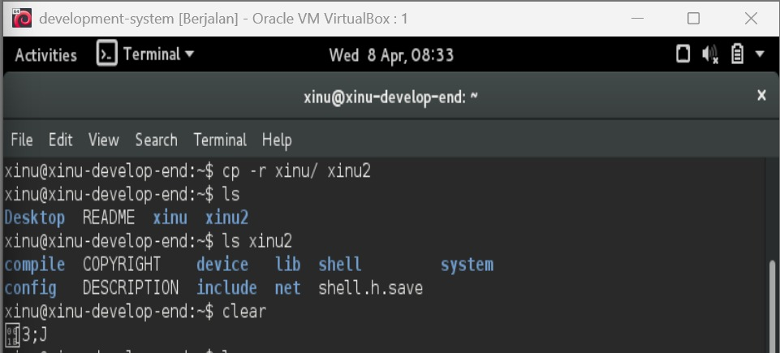
4. Kemudian ketik wget agha.work/modul6.sh, bertujuan untuk buat program di dalam xinu, jika ingin cek sudah ke save belum ketik "ls"
   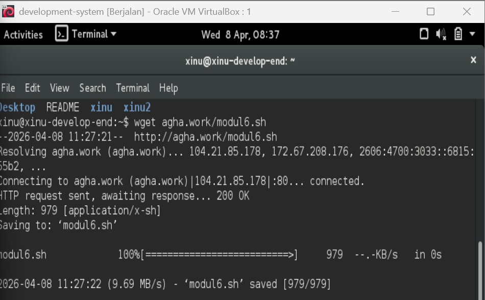
5. Lalu modifikasi file dengan "chmod +x modul6.sh" , karena belum bisa di eksekusi script nya. Ketika ketik "ls" lagi bakalan keluar warna hijau pada tulisan modul6.sh berrati bisa dijalankan
6. Cara menjalankannya ketik "./modul6.sh"
   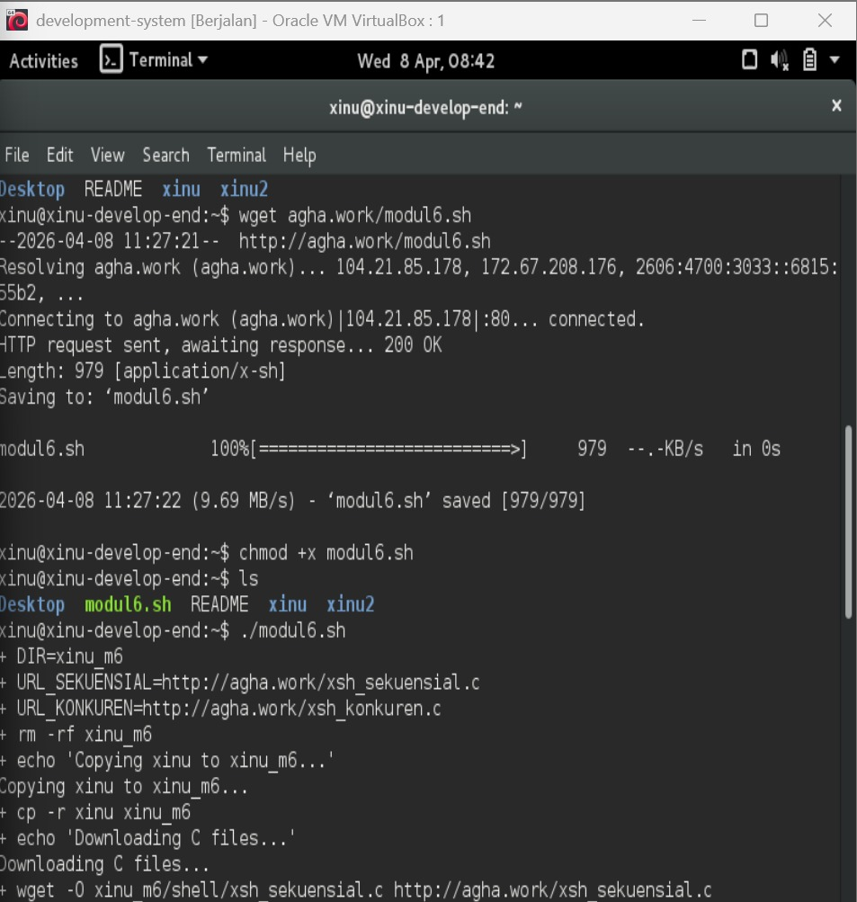
7. Bersihkan xinu_m6/compile dengan ketik "cd xinu_m6/compile/" lalu ketik "make clean" lalu "make" jika error maka ulang "make" lagi
   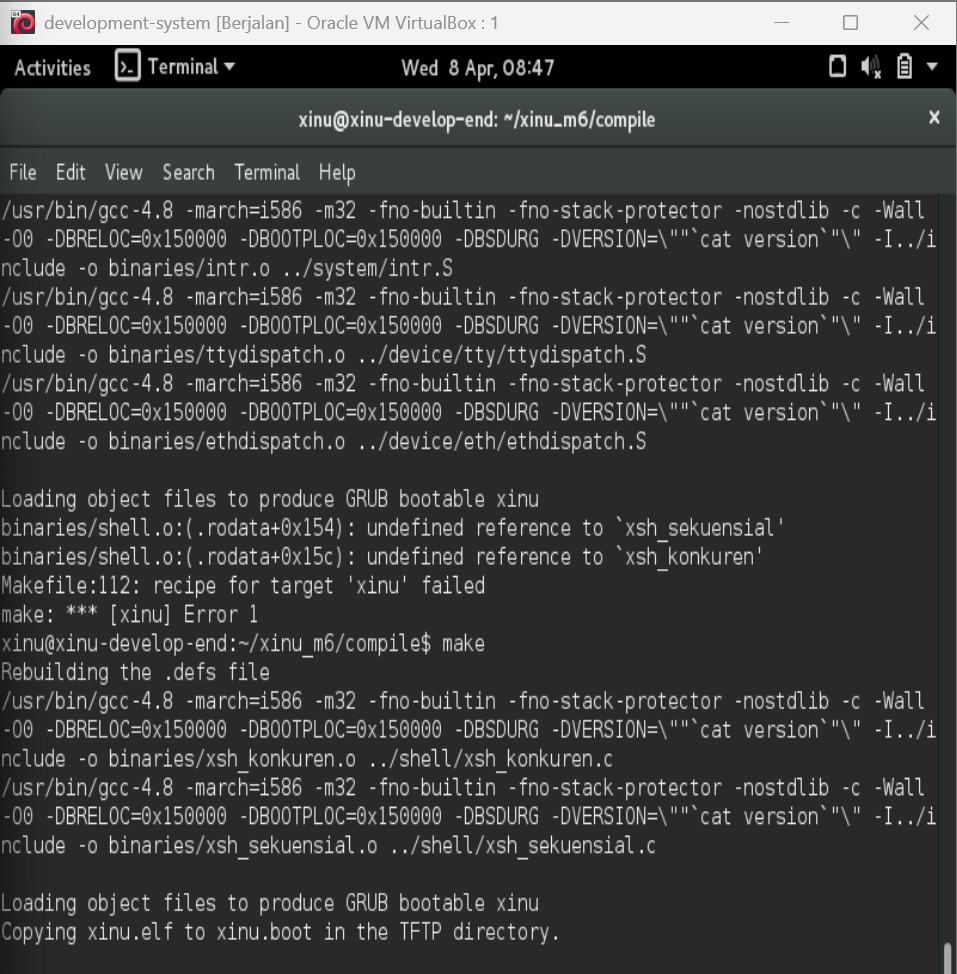
8. Kemudian run backend yang di VirtualBox
9. lalu ketik sudo minicom dan login dengan sandi "xinurocks" dan ketik "help"
10. Kemudian ketik "sekuensial" 
    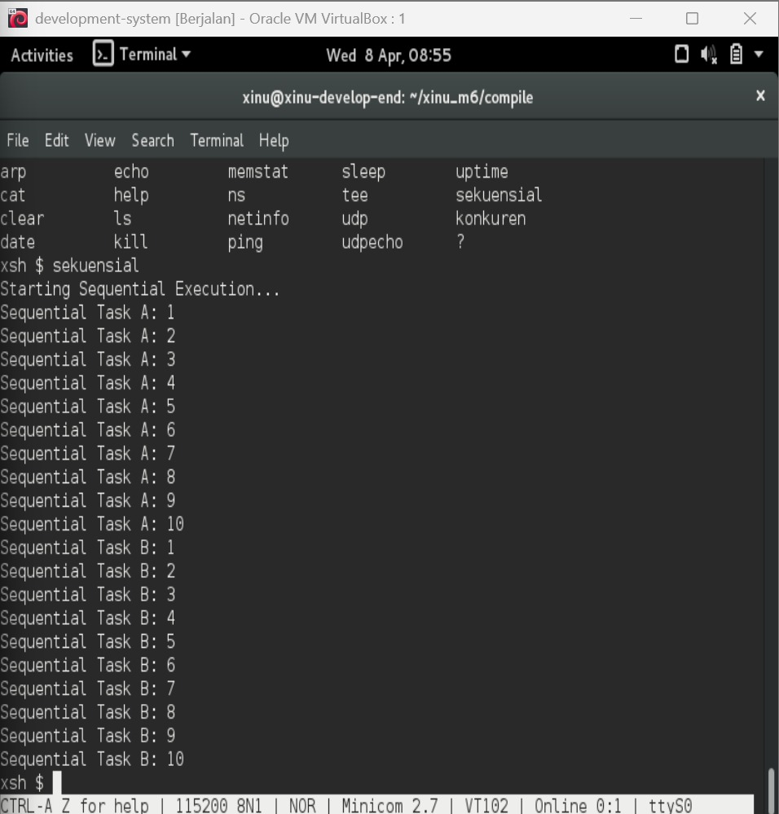
11. Kita coba ketik "konkuren" juga
    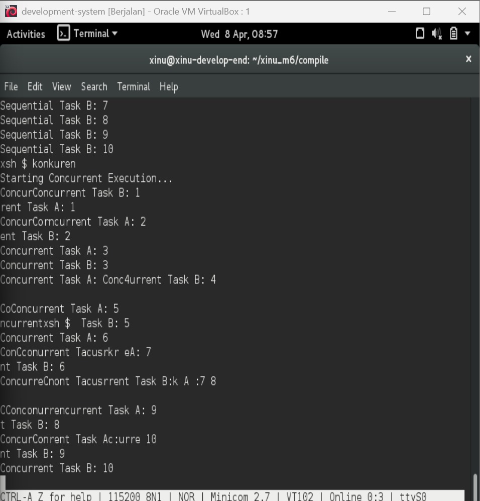

## C. Unguided

### 1. Selain hardware (memory), batasan maksimal proses dapat ditentukan dengan secara software.  Pada Linux maksimal proses adalah 4194303 proses (64 bit) dan 32767 proses (32 bit) dapat dilihat melalui perintah $cat /proc/sys/kernel/pid_max 

Carilah pada source code Xinu yang memberi batasan mengenai banyaknya proses yang bisa dibuat! Berapa maksimal proses dalam Xinu?  Ubah menjadi maksimal 150 proses! 

Jawab : 

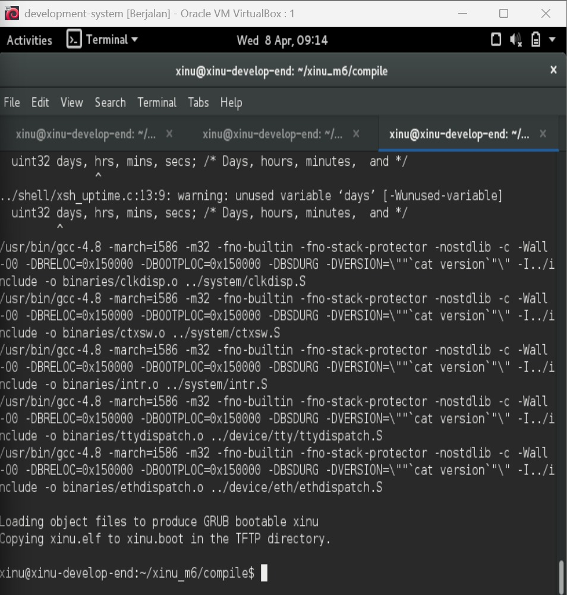
Batas maksimal proses pada Xinu ditentukan secara software melalui konstanta NPROC pada file process.h. Nilai awal maksimal proses pada Xinu adalah 8 proses. Pada praktikum ini nilai tersebut diubah menjadi 150 proses dengan memodifikasi konstanta NPROC.

Langkah pengerjaan :
1. Jalankan development-sysyem
2. Ketik "cd xinu/compile/include"
3. Lalu ketik "gedit process.h"
4. Cari konstanta jumlah maksimal proses:  #define NPROC  , lalu ubah menjadi 150
   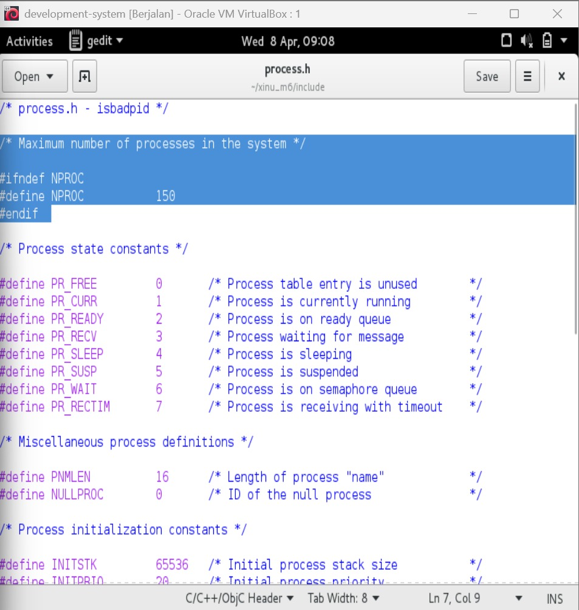
5. Klik save 
6. Lakukan kompilasi ulang seperti no 2 , lalu make clean dan make

### 2.  Jalankan kode sekuensial! 

Jawab :  

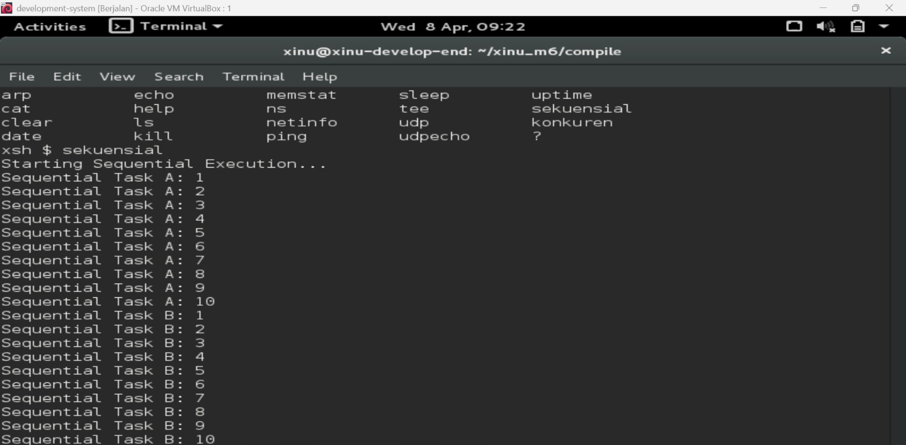
Kode sekuensial dijalankan dengan perintah sekuensial pada shell Xinu. Pada proses sekuensial, setiap proses dieksekusi secara berurutan, dimana proses berikutnya akan berjalan setelah proses sebelumnya selesai dieksekusi. Hal ini menyebabkan output tampil secara terurut tanpa adanya interleaving antar proses.

Langkah pengerjaan  :
1. Jalankan minicom dengan ketik "sudo minicom"
2. Masukkan password "xinurocks"
3. jalankan perintah "sekuensial"

### 3.  Jalankan kode konkuren!

Jawab: 

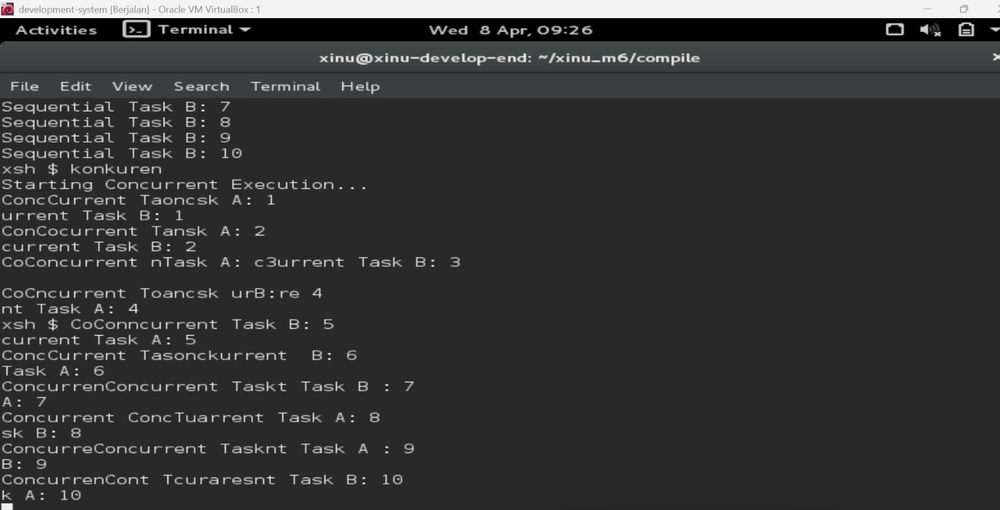
Kode konkuren dijalankan dengan perintah konkuren pada shell Xinu. Pada proses konkuren, beberapa proses berjalan secara bersamaan atau bergantian berdasarkan scheduler CPU. Akibatnya output dari tiap proses dapat tampil secara tidak berurutan karena proses dieksekusi secara overlap/interleaving.

Langkah pengerjaan :
1. Pada shell Xinu jalankan perintah: konkuren

### 4.  Buatlah 2 proses produser dan konsumer. Produser memproduksi angka integer dari 1-1000. Konsumer mengkonsumsi integer yang diproduksi oleh produser dan menampilkannya! (Gunakan variabel global bertipe int32 bernama n yang digunakan secara bersama oleh kedua proses)

int32 n = 0; //global variabel

void produser(void){
    int32 i;
    for (i=1; i<=1000; i++){
            n++;	
    }
}

void konsumer(void){
    int32 i;
    for (i=1; i<=1000; i++){
        printf("Nilai dari n adalah %d\n",n);	
    }
}

Hasil dari program ini cukup mengejutkan (tidak akan sesuai dengan intuisi awal). Jelaskan mengapa hasilnya seperti itu!

Jawab : 

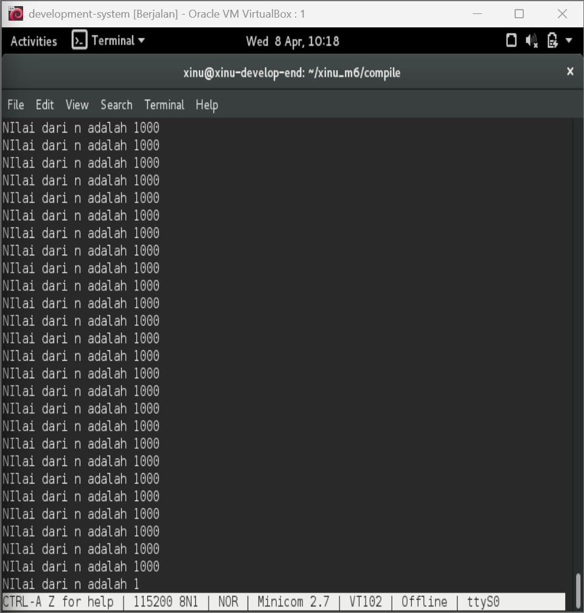
Program menampilkan nilai variabel n yang dibaca oleh proses konsumer selama proses produser melakukan increment terhadap variabel tersebut. Hasil output yang muncul tidak selalu berurutan atau sesuai ekspektasi. 

Penjelasan mengapa output tidak sesuai intuisi :
Hasil program terlihat mengejutkan karena proses produser dan konsumer berjalan secara konkuren, yaitu dieksekusi bergantian oleh scheduler CPU. Kedua proses tersebut mengakses variabel global yang sama (n) secara bersamaan tanpa mekanisme sinkronisasi. Akibatnya terjadi race condition, yaitu kondisi ketika dua atau lebih proses mengakses dan memodifikasi data bersama secara bersamaan sehingga hasil eksekusi bergantung pada urutan scheduling proses oleh sistem operasi.
Pada kasus ini:
- Produser dapat menambah nilai n kapan saja.
- Konsumer dapat membaca nilai n sebelum atau sesudah produser memperbaruinya.
- Urutan eksekusi kedua proses tidak dapat diprediksi secara pasti.
Karena itu nilai yang ditampilkan oleh konsumer dapat:
- tidak berurutan,
- berulang,
- atau tidak sesuai dengan intuisi awal bahwa nilai akan bertambah secara teratur dari 1 sampai 1000.

Langkah pengerjaan :
1. Masuk ke Folder Project Modul 6 : cd xinu_m6
2. Karena sudah ada command sekuensial, kita copy aja supaya formatnya aman. : cp shell/xsh_sekuensial.c shell/xsh_prodcons.c
3. Buka file baru : gedit shell/xsh_prodcons.c
4. Ganti isi file jadi :
#include <xinu.h>
int32 n = 0;

void produser(void) {
    int32 i;
    for (i = 1; i <= 1000; i++) {
        n++;
    }
}

void konsumer(void) {
    int32 i;
    for (i = 1; i <= 1000; i++) {
        printf("Nilai dari n adalah %d\n", n);
    }
}

shellcmd xsh_prodcons(int nargs, char *args[]) {
    resume(create(produser, 1024, 20, "produser", 0));
    resume(create(konsumer, 1024, 20, "konsumer", 0));
    return 0;
}
5. lalu save
6. Cari Tempat Daftar Command sekuensial : nano ~/xinu_m6/shell/shell.c
7. Tekan Ctrl + W , lalu ketik sekuensial dan enter
8. Tambahkan Baris Ini di Bawahnya : {"prodcons", xsh_prodcons}, 
   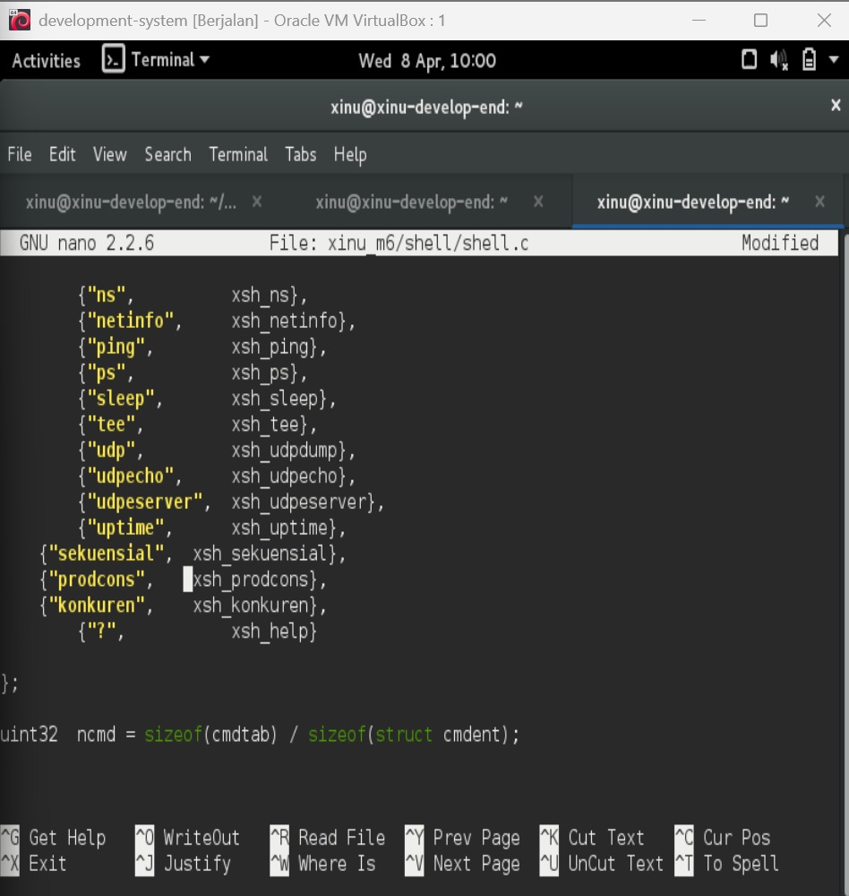
9. Tekan Ctrl + o untuk save lalu enter
10. Buka Prototype pakai Nano :  nano xinu_m6/include/shprototypes.h
11. Tekan Ctrl + W lalu ketik xsh_sekuensial dan enter
12. Tambahkan dibawahnya : extern shellcmd xsh_prodcons(int32, char *[]);
    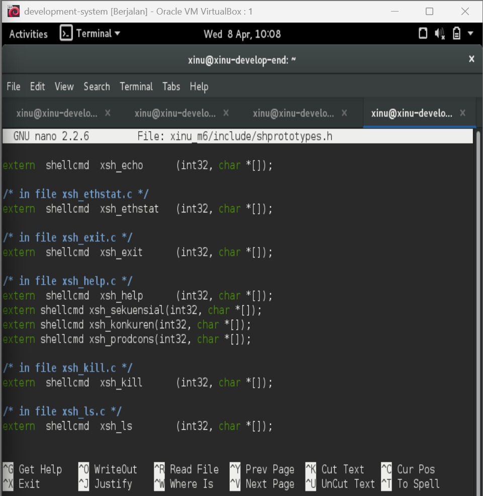
13. Tekan Ctrl + o untuk save lalu enter
14. Ctrl X
15. Compile program dengan cd xinu_m6/compile sampai sudo minicom
16. ketik prodcons

## D. Referensi

1. https://binus.ac.id/bandung/2019/12/rangkaian-sekuensial/
2. https://www.academia.edu/126969026/KONKURENSI_PADA_SISTEM_OPERASI

