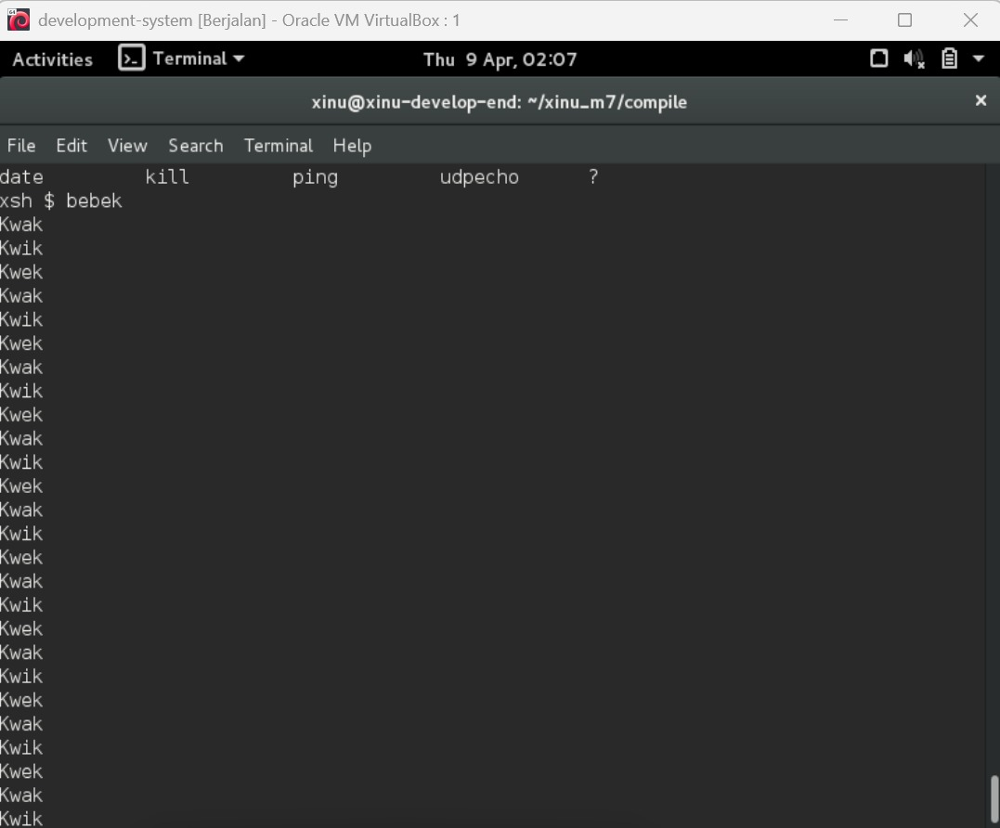
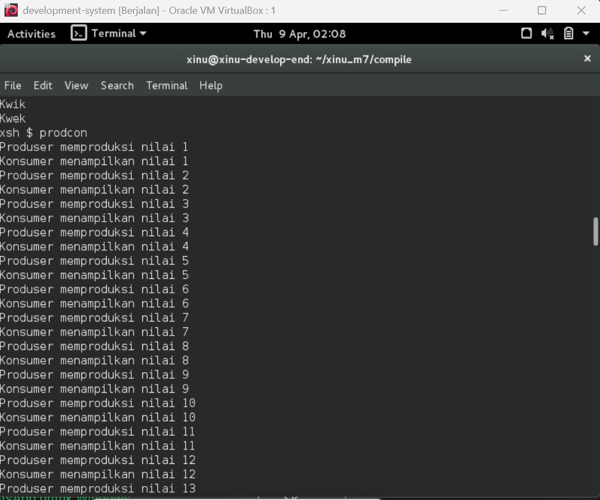

# <h1 align="center">Laporan Praktikum Modul 7    Semaphore </h1>

SHILFI HABIBAH - 2311104002

## A. Dasar Teori

### a. Pengertian dan Tujuan
Semaphore adalah mekanisme penting yang digunakan untuk mengelola eksekusi bersamaan (konkuren) dari berbagai proses. Tujuannya adalah untuk mencegah terjadinya benturan data (race condition) ketika beberapa proses mengakses sumber daya yang sama, serta untuk memastikan urutan eksekusi antar proses berjalan sesuai keinginan. Meskipun awalnya terdengar rumit, konsep ini dapat dipahami dengan mudah melalui dua kasus utama: Mutex (saling eksklusi) dan Signaling (pemberian sinyal urutan).

## B. Guided

Langkah - langkah : 
1. Running Development-system yang di VirtualBox
2. Ketik ls pada terminal
3. Ketik wget agha.work/modul7.sh
4. Ketik ls lagi untuk cek modul 7 tersimpan atau engga
5. Setelah tersimpan , ketik chmod +x modul7.sh
6. Cek lagi menggunakan ls
7. Lalu ketik cat modul7.sh
8. Kemudian masuk ke folder modul dengan ketik ./modul7.sh
9. Cek lagi menggunakan ls 
10. Kemudian masuk ke folder xinu m7 dengan ketik cd xinu_m7/compile/
11. Setelah itu compile dengan ketik make clean , lalu ketik make. Jika gagal ketik ulang make lagi sampai berhasil ngga error
12. Lalu ketik sudo minicom dan run backend 

## C. Unguided

### 1. Buatlah 3 buah proses yaitu P1, P2 dan P3. P1 selalu menampilkan “kwak”, P2 selalu menampilkan “kwik”, P3 selalu menampilkan “kwek”. Menggunakan 3 proses tersebut dan beberapa buah semaphore, buatlah program yang dapat menampilkan:  

Jawab : 

Setelah perintah bebek dijalankan pada terminal Xinu, program menampilkan output berupa teks "Kwak", "Kwik", dan "Kwek" secara bergantian dan berulang. Hasil ini membuktikan bahwa ketiga proses P1, P2, dan P3 berhasil berjalan secara konkuren dengan urutan yang teratur berkat sinkronisasi semaphore, di mana setiap proses hanya berjalan setelah menerima sinyal dari proses sebelumnya.

Langkah pengerjaan :
1. Dari Guided setelah sudo minicom dinyalakan dan masuk ke pw akan muncul xinu 
2. Lalu ketik help untuk melihat struktur 
3. Ketik Bebek dan akan muncul hasil seperti gambar diatas

### 2. Buatlah proses bernama produser yang memproduksi bilangan 1-1000. Buatlah proses bernama konsumer yang akan menampilkan nilai yang diproduksi oleh produser. Gunakan semaphore! 
 
Jawab :  

Setelah perintah prodcon dijalankan pada terminal Xinu, program menampilkan output secara bergantian antara "Produser memproduksi nilai" dan "Konsumer menampilkan nilai" mulai dari angka 1 hingga 1000. Hasil ini membuktikan bahwa proses produser dan konsumer berhasil berjalan secara sinkron menggunakan semaphore, di mana konsumer hanya menampilkan nilai setelah produser selesai memproduksinya dan produser tidak akan memproduksi nilai berikutnya sebelum konsumer selesai menampilkan nilai saat ini.

Langkah pengerjaan  :
1. Langusng ketik aja perintah Prodcons setelah tadi ketik bebek pada terminal

## D. Referensi

1. https://medium.com/@nayarasuratinoyo7/semaphore-itu-mudah-panduan-praktis-untuk-pemula-27408d8c8b4e

