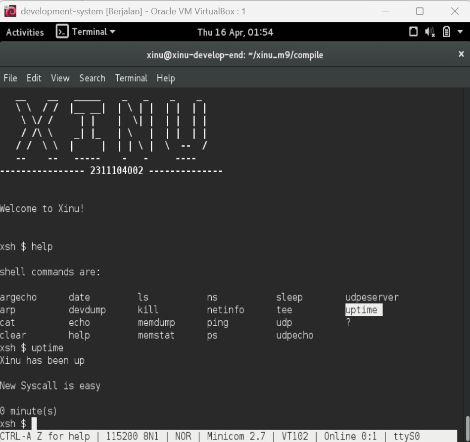
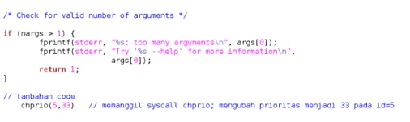
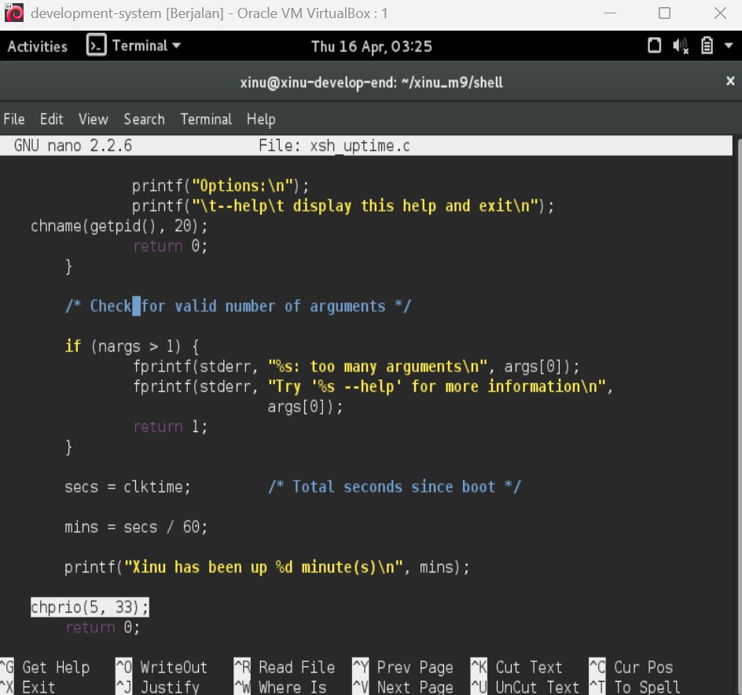
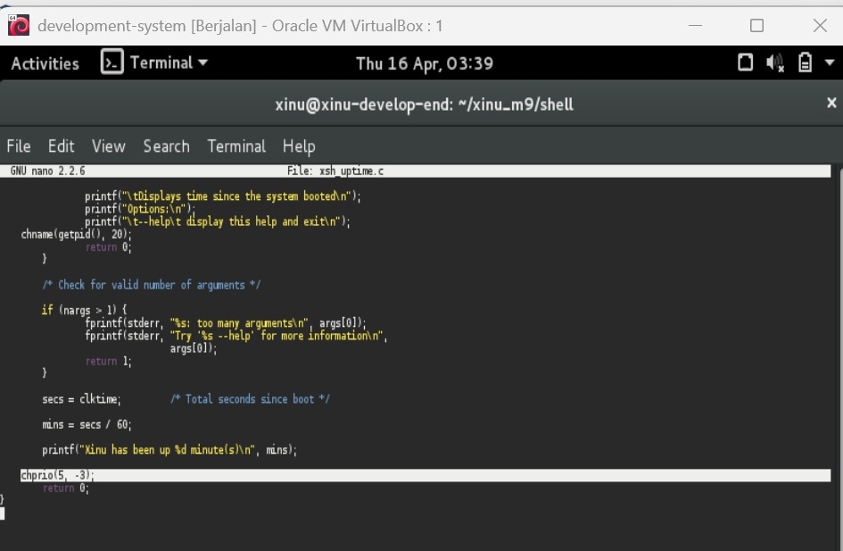

# <h1 align="center">Laporan Praktikum Modul 7    Syscall Xinu </h1>

SHILFI HABIBAH - 2311104002

## A. Dasar Teori

### a. Pengertian 
Syscall adalah antarmuka layanan yang disediakan oleh sistem operasi untuk digunakan oleh proses. Melalui syscall, sebuah proses dapat meminta bantuan OS tanpa harus mengetahui detail internalnya. Selain itu, syscall juga berfungsi sebagai mekanisme keamanan dan penyembunyian informasi (information hiding).
### b. Cara Kerja
- Sistem akan menonaktifkan interupsi ketika syscall dipanggil.
- Argumen yang diberikan oleh proses pemanggil akan diperiksa terlebih dahulu.
- Layanan inti dijalankan sesuai permintaan proses. Misalnya, jika yang dipanggil adalah freemem(), maka tugasnya adalah membebaskan blok memori pada alamat tertentu.
- Setelah selesai, interupsi diaktifkan kembali agar proses lain bisa berjalan.
- Hasil eksekusi (berhasil atau gagal) dikembalikan kepada proses pemanggil.

## B. Guided

Langkah - langkah : 
1. Running Development-system yang di VirtualBox
2. Ketik ls pada terminal
3. Download script modul : wget agha.work/modul9.sh
4. Cek isi file : cat modul9.sh 
5. Beri permission : chmod +x modul9.sh
6. Jalankan script ./modul9.sh
7. Compile project dengan cd xinu_m9/compile/ lalu make clean setelah itu make
8. Jalankan Xinu dengan sudo minicom
9. Cek syscall baru dengan ketik help
10. Jalankan syscall dengan ketik uptime

## C. Unguided

### 1. Buat syscall baru seperti yang ditunjukkan pada modul syscall poin 9.5! (sertakan Screenshot kode dan hasil run)  

Jawab : 

Output yang dihasilkan menunjukkan bahwa proses pembuatan syscall baru berhasil dilakukan. Hal ini terlihat dari berhasilnya script modul9.sh dijalankan tanpa error, di mana sistem membuat direktori baru xinu_m9, menyalin source code Xinu, serta menambahkan file baru chname.c ke dalam folder sistem. Setelah dilakukan proses kompilasi menggunakan make clean dan make, sistem berhasil dibangun kembali tanpa kendala. Ketika Xinu dijalankan melalui minicom, sistem berhasil booting dan menampilkan shell Xinu. Saat perintah uptime dijalankan, muncul output seperti “Xinu has been up” dan “New Syscall is easy”, yang menandakan bahwa syscall baru telah terintegrasi dan dapat dieksekusi dengan baik.

Langkah pengerjaan :
1. Dari Guided setelah sudo minicom dinyalakan dan masuk ke pw akan muncul xinu 
2. Lalu ketik help untuk melihat struktur 
3. Ketik uptime dan akan muncul hasil seperti gambar diatas

### 2. Perbaiki syscall chprio (xinu/system/chprio.c) dengan memperhatikan validasi input 
- Pastikan id adalah angka dari 0 – NPROC (ukuran maks banyaknya proses)
- Pastikan prioritas adalah bilangan yang positif
Compile dan jalankan Xinu dengan syscall yang telah diperbaiki
- make clean
- make
 
Jawab :  

Setelah dilakukan perbaikan pada syscall chprio dengan menambahkan validasi terhadap PID dan nilai prioritas, hasil output menunjukkan bahwa sistem berhasil menangani input secara lebih aman. Ketika dilakukan kompilasi ulang, tidak ditemukan error, menandakan perubahan kode berhasil diterapkan. Saat syscall dijalankan dengan input yang valid, perubahan prioritas proses berjalan dengan normal. Sebaliknya, ketika diberikan input yang tidak valid (seperti PID di luar batas atau prioritas bernilai negatif), sistem tidak mengalami crash dan tidak melakukan perubahan pada prioritas proses. Hal ini membuktikan bahwa validasi yang ditambahkan bekerja dengan baik untuk mencegah kesalahan input.

Langkah pengerjaan  :
1. Masuk ke folder hasil modul : cd xinu_m9
2. Masuk ke folder system : ketik ls (Biasanya muncul "compile  config  include  system  shell" ) lalu ketik cd system
3. Cari file chprio.c : cek isi folder dengan ketik ls , nanti ada chprio.c
4. Edit file chprio.c : nano chprio.c
5. Tambahkan validasi dalam function chprio : || newprio <= 0 (Biasanya ditaruh di awal function sebelum proses perubahan prioritas)
6. Simpan file dengan CTRL + O → Enter 
7. Ketik CTRL + X untuk kembali ke terminal awal
8. Kembali ke folder compile : cd ../compile
9. Compile ulang dengan make clean & make

### 3. Lakukan hal-hal berikut ini
- Edit xsh_uptime.c 
  Tambahkan kode berikut 
  
  
- Compile source code tersebut dengan perintah (make clean, make)
- Jalankan perintah ps (xsh $ ps, perhatikan prioritas proses dengan id = 5)
- Jalankan uptime (xsh $ uptime, Perhatikan hasil perintah tersebut)
- Jalankan ps (xsh $ ps, perhatikan prioritas proses dengan id = 5 seharusnya sudah berubah)

Testing chprio syscall yang telah diubah

a. Testing prioritas tidak boleh < 0: Ubah “chprio(5,33) menjadi “chprio(5,-3)” pada xsh_uptime.c

b. Testing id adalah valid: Ubah “chprio(5,33)” menjadi “chprio(3000,3)”

c. Hasil dua testing di atas adalah prioritas tidak berubah karena salah argument (dibuktikan dengan menggunakan perintah ps)

Jawab :  

a. 

Langkah pengerjaan  :
1. Membuka file xsh_uptime.c pada direktori cd xinu_m9/shell menggunakan text editor.
2. Buka file : nano xsh_uptime.c
3. Menambahkan kode chprio(5, 33); setelah perintah printf("Xinu has been up ..."); dan sebelum return 0;. 
   
4. Simpan file dengan CTRL + O → Enter 
5. Ketik CTRL + X untuk kembali ke terminal awal
6. Kembali ke folder compile : cd ../compile
7. Compile ulang dengan make clean & make
8. Menjalankan sistem Xinu menggunakan perintah: sudo minicom
9. Menjalankan perintah ps untuk melihat prioritas awal proses dengan PID = 5.
10. Menjalankan perintah uptime untuk mengeksekusi syscall yang telah ditambahkan.
11. Menjalankan kembali perintah ps untuk melihat perubahan prioritas proses.

b. 

Langkah pengerjaan  :
1. Keluar dari Xinu dulu : CTRL + A lalu X
Membuka file xsh_uptime.c pada direktori cd xinu_m9/shell menggunakan text editor.
3. Buka file : nano xsh_uptime.c
4. Mengubah parameter syscall menjadi: chprio(5, -3);
   
5. Simpan file dengan CTRL + O → Enter 
6. Ketik CTRL + X untuk kembali ke terminal awal
7. Kembali ke folder compile : cd ../compile
8. Compile ulang dengan make clean & make
9. Menjalankan sistem Xinu menggunakan perintah: sudo minicom
10. Menjalankan perintah ps untuk melihat prioritas awal
11. Menjalankan perintah uptime 
12. Menjalankan kembali perintah ps untuk melihat apakah terjadi perubahan.

c. 

Langkah pengerjaan  :
1. Keluar dari Xinu dulu : CTRL + A lalu X
Membuka file xsh_uptime.c pada direktori cd xinu_m9/shell menggunakan text editor.
3. Buka file : nano xsh_uptime.c
4. Mengubah parameter syscall menjadi: chprio(3000, 3);
   
5. Simpan file dengan CTRL + O → Enter 
6. Ketik CTRL + X untuk kembali ke terminal awal
7. Kembali ke folder compile : cd ../compile
8. Compile ulang dengan make clean & make
9. Menjalankan sistem Xinu menggunakan perintah: sudo minicom
10. Menjalankan perintah ps untuk melihat prioritas awal
11. Menjalankan perintah uptime 
12. Menjalankan kembali perintah ps untuk melihat apakah terjadi perubahan.

## D. Referensi

1. https://telkomuniversityofficial-my.sharepoint.com/shared?listurl=https%3A%2F%2Ftelkomuniversityofficial-my.sharepoint.com%2Fpersonal%2Fmaghaz_student_telkomuniversity_ac_id%2FDocuments&id=%2Fpersonal%2Fmaghaz_student_telkomuniversity_ac_id%2FDocuments%2F2026%2F00.+Modul+Praktikum+Sistem+Operasi+SE+2526-2.pdf&parent=%2Fpersonal%2Fmaghaz_student_telkomuniversity_ac_id%2FDocuments%2F2026&shareLink=1&ga=1
2. https://medium.com/@krisnawahyudipratama/memahami-syscall-konsep-mekanisme-dan-implementasi-di-xinu-7d1cdf7a2b7f

