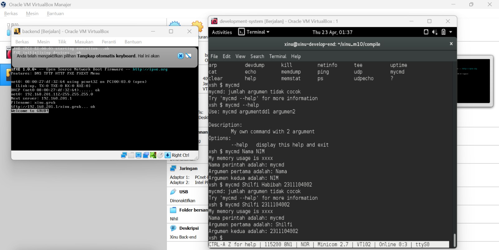
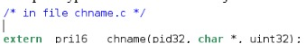
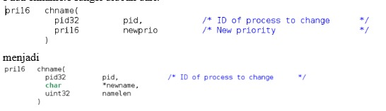
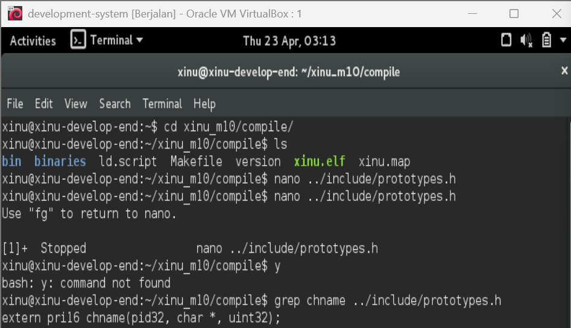
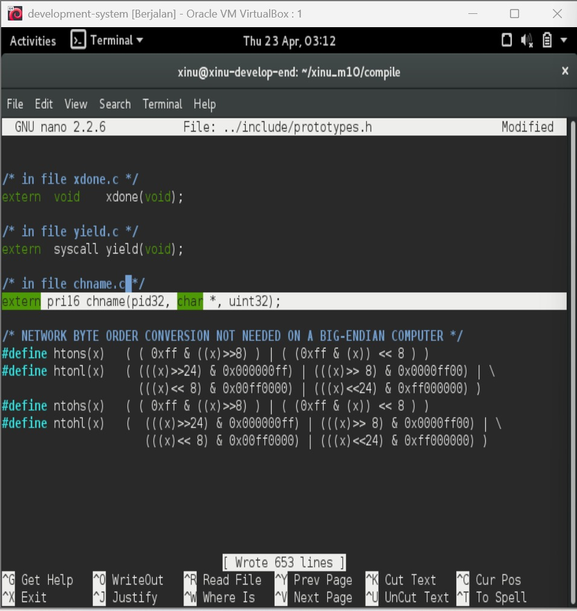
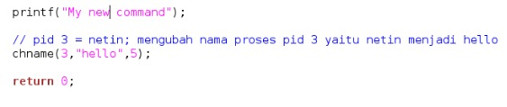
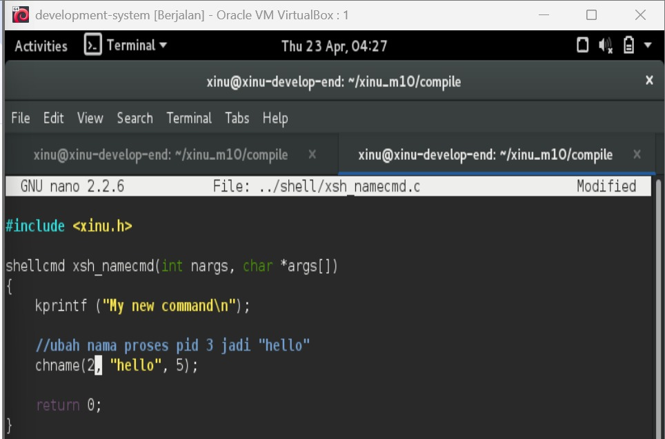
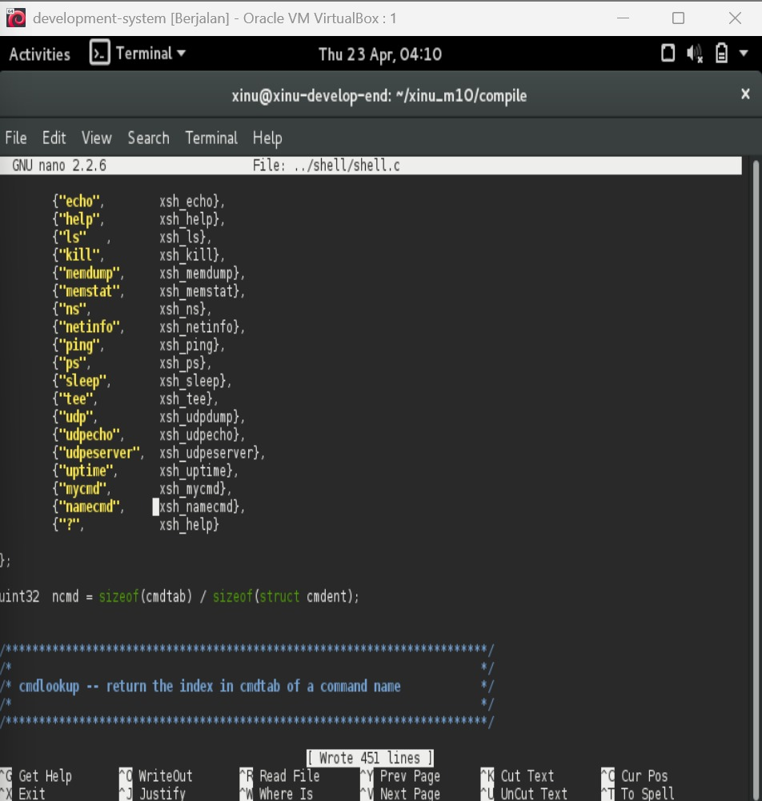

# <h1 align="center">Laporan Praktikum Modul 10    Shell </h1>

SHILFI HABIBAH - 2311104002

## A. Dasar Teori

### a. Pengertian 
Shell merupakan penghubung antara manusia dan sistem operasi. Ia menerjemahkan instruksi yang kita ketik menjadi sesuatu yang bisa dimengerti oleh komputer. Shell adalah program yang memproses perintah yang diberikan oleh user pada terminal. Shell akan looping secara terus menerus membaca baris input yang diberikan. Setelah sebuah baris input dibaca ditandai dengan adanya ENTER, shell harus mengekstrak nama perintah, argumen dan hal-hal lainnya. Jika proses ektraksi berhasil maka perintah akan dieksekusi sesuai dengan argumen yang diberikan.
Contoh perintah pada shell:
ls -al
nama_perintah = “ls”
argument 1 = “-al”

## B. Guided

Langkah - langkah : 
1. Running Development-system yang di VirtualBox
2. Ketik ls pada terminal
3. Download script modul : wget agha.work/modul10.sh 
4. Beri permission : chmod +x modul10.sh
5. Jalankan script ./modul10.sh
6. Compile project dengan cd xinu_m10/compile/ lalu make clean setelah itu make
7. Jalankan Xinu dengan sudo minicom
8. Cek syscall baru dengan ketik help
8. Jalankan syscall dengan ketik mycmd  

## C. Unguided

### 1.  Akan dimodifikasi shell dengan modifikasi syscall bernama chname yang berfungsi untuk mengubah nama suatu proses. Lihat kembali modul sebelumnya cara membuat syscall. 

Perhatikan sekarang syscall chname mempunyai 3 parameter yaitu pid, character dan panjang character. Character untuk menyimpan nama dan panjang character untuk panjang nama.

a. Pada prototypes.h chname diubah menjadi:

   

b. Pada chname.c fungsi diubah dari:

   

Modifikasi kode pada chname.c sehingga nama proses bisa diubah bila syscall tersebut dipanggil.

Jawab : 

a.

Langkah pengerjaan :
1. Masuk ke project Xinu : cd xinu_m10/compile/
2. Mengecek isi folder : ls
3. Edit file prototypes.h : nano ../include/prototypes.h
4. Tambahkan paling bawah : extern pri16 chname(pid32, char *, uint32);
   
5. Simpan perubahan : CTRL + O -> enter
6. Keluar dari nano : CTRL + X
7. Verifikasi perubahan : grep chname ../include/prototypes.h

b. 

Langkah pengerjaan :
1. Masuk ke folder compile : cd xinu_m10/compile/
2. Membuka file chname.c : nano ../system/chname.c
3. Mengubah header fungsi : pri16 chname(pid32 pid, char *newname, uint32 namelen)
4. Menghapus kode lama (pengubahan priority) : 
   pri16 oldprio;
   oldprio = prptr->prprio;
   prptr->prprio = newprio;
   return oldprio;
5. Menambahkan kode untuk mengubah nama proses: 
   int i;
   for(i = 0; i < namelen && i < PNMLEN-1; i++){
      prptr->prname[i] = newname[i];
   }
   prptr->prname[i] = '\0';
6. Mengubah nilai return : return OK;
7. Menyimpan perubahan : CTRL + O → ENTER → CTRL + X
8. Melakukan compile ulang : make clean, make

### 2.  Buatlah perintah baru bernama namecmd sesuai dengan langkah-langkah pada no.5 pada modul shell!
Berikut adalah kode dalam perintah baru namecmd:

 
Jawab :  

Langkah pengerjaan  :
1. Masuk ke folder compile : cd xinu_m10/compile/
2. Membuat file : nano ../shell/xsh_namecmd.c
3. Menuliskan kode program : 
   
4. Menyimpan file : CTRL + O → ENTER → CTRL + X 
5. Membuka file : nano ../shell/shell.c
6. Menambahkan pada cmdtab : {"namecmd", xsh_namecmd},
   
7. Menambahkan deklarasi function pada bagian atas file shell.c : extern shellcmd xsh_namecmd(int, char *[]);
8. Melakukan compile : make clean, make
9. Menjalankan sistem Xinu : sudo minicom
10. Menguji command : help, ps , namecmd, ps

### 3. Test hasilnya: 
a. Masuk ke terminal xinu
b. Jalankan perintah ps
c. Jalankan perintah namecd
d. Jalankan perintas ps
e. Lihat nam proses telah berubah 

Jawab :  

Pengujian dilakukan dengan menjalankan perintah ps untuk melihat daftar proses yang sedang berjalan. Kemudian dijalankan perintah namecmd yang berfungsi untuk mengubah nama proses menggunakan syscall chname. Setelah itu, perintah ps dijalankan kembali untuk melihat hasil perubahan. Dari hasil pengujian, terlihat bahwa nama proses yang sebelumnya adalah netin berhasil berubah menjadi hello, sehingga dapat disimpulkan bahwa command namecmd dan syscall chname telah berjalan dengan baik.

## D. Referensi

1. https://telkomuniversityofficial-my.sharepoint.com/shared?listurl=https%3A%2F%2Ftelkomuniversityofficial-my.sharepoint.com%2Fpersonal%2Fmaghaz_student_telkomuniversity_ac_id%2FDocuments&id=%2Fpersonal%2Fmaghaz_student_telkomuniversity_ac_id%2FDocuments%2F2026%2F00.+Modul+Praktikum+Sistem+Operasi+SE+2526-2.pdf&parent=%2Fpersonal%2Fmaghaz_student_telkomuniversity_ac_id%2FDocuments%2F2026&shareLink=1&ga=1
2. https://medium.com/@stevenindramer08/mengeksplore-shell-dalam-xinu-289ec93954a4

