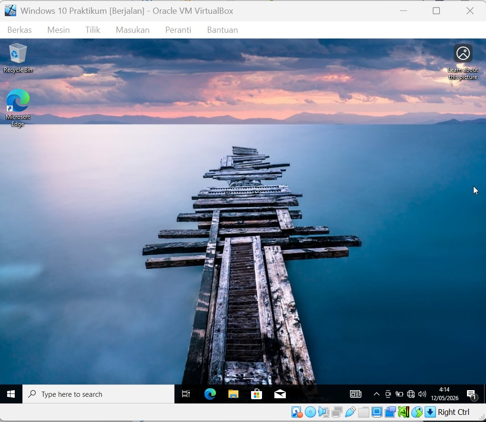
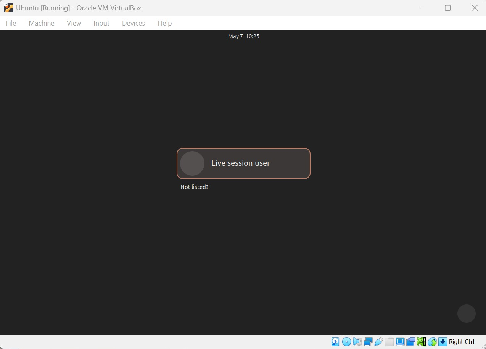

# <h1 align="center">Laporan Praktikum Modul 12    Linux dan Windows </h1>

SHILFI HABIBAH - 2311104002

## A. Dasar Teori

### a. Pengertian Virtual Machine dan Sistem Operasi 
Virtual Machine (VM) adalah emulasi perangkat lunak dari sistem komputer yang berfungsi seolah-olah merupakan komputer fisik yang terpisah. VirtualBox merupakan salah satu perangkat lunak hypervisor yang memungkinkan instalasi berbagai Sistem Operasi (OS) di atas sistem operasi utama (host). Sistem Operasi adalah perangkat lunak sistem yang mengelola perangkat keras komputer, sumber daya perangkat lunak, dan menyediakan layanan umum untuk program komputer. Dalam praktikum ini, digunakan dua jenis OS yang berbeda:
- Windows 10: Sistem operasi closed-source komersial yang dikembangkan oleh Microsoft.
- Ubuntu 24.04: Distribusi Linux open-source berbasis Debian yang menggunakan kernel Linux sebagai inti sistemnya.

## B. Guided

### 1. Instalasi Windows 10

Langkah-langkah : 
1. Buka Oracle VM VirtualBox, klik New, beri nama "Windows 10 Praktikum", dan pilih file ISO Windows 10 yang telah diunduh.
2. Atur kapasitas RAM (disarankan 2GB atau lebih) dan jumlah prosesor.
3. Buat Virtual Harddisk dengan kapasitas minimal 50GB.
4. Jalankan mesin (Start), pilih bahasa dan wilayah, lalu pilih Windows 10 Pro.
5. Pilih opsi Custom: Install Windows only (advanced) dan buat partisi baru pada ruang kosong yang tersedia.
6. Tunggu proses penyalinan file dan loading "Just a moment" hingga muncul layar konfigurasi akun.
7. Buat akun pengguna dengan nama "Shilfi" dan kosongkan password untuk kemudahan akses.
8. Setelah masuk desktop, instal VirtualBox Guest Additions melalui menu Devices > Insert Guest Additions CD Image agar resolusi layar dapat diatur secara otomatis.

### 2. Instalasi Ubuntu 24.04
Langkah-langkah:

1. Buat mesin virtual baru kembali dengan tipe Linux dan versi Ubuntu (64-bit).
2. Atur Sistem > Akselerasi ke KVM dan Tampilan > Memori Video ke 128 MB untuk menghindari masalah layar hitam (blank screen).
3. Jalankan mesin, jika muncul menu GNU GRUB, pilih Ubuntu (safe graphics) untuk memastikan tampilan visual muncul dengan aman.
4. Pilih bahasa instalasi, lalu klik Install Ubuntu.
5. Pilih tipe instalasi Normal installation dan centang "Download updates while installing Ubuntu".
6. Pilih Erase disk and install Ubuntu (ini hanya menghapus isi harddisk virtual, bukan harddisk asli laptop).
7. Atur lokasi waktu (Jakarta) dan buat akun pengguna (Username & Password).
8. Tunggu proses "Menyalin berkas" atau copying files hingga selesai, lalu klik Restart Now.

## C. Unguided
### 1. Jelaskan dengan bahasa sendiri, apa itu Sistem Operasi?
jawab : 

Sistem Operasi (OS) adalah program utama yang bertindak sebagai jembatan antara pengguna (user) dan perangkat keras (hardware) komputer. Tanpa OS, kita tidak bisa memberikan perintah ke komputer untuk menjalankan aplikasi atau menyimpan data.

### 2. Buka dxdiag pada kolom search windows, dan jawab pertanyaan berikut!
a. Windows apakah yang diinstal? Windows 10 Pro

b. Berapa bit Windows yang diinstall? 64-bit

c. Berapa kecepatan processor yang digunakan? 2.40GHz

d. Grafik yang digunakan versi berapa? Apakah sudah sesuai dengan spesifikasi rekomendasi pada modul? Iya, sudah sesuai.

### 3. Apa kelebihan dari windows yang terpasang sekarang? Sebutkan versiberapa windows terbaru saat ini!
Jawab: 

- Kelebihan: Memiliki antarmuka yang user-friendly, - kompatibel dengan banyak software praktikum, dan memiliki fitur keamanan Windows Defender yang baik.
Versi Windows Terbaru: Windows 11.

### 4. Buka virtualbox, dan jawab pertanyaan berikut!
a. Linux apakah yang diinstall? Ubuntu 24.04 LTS.

b. Berapa bit Linux yang diinstall? 64-bit.

c. Berapa ukuran hard disk virtual mesin? 25 GB

d. Terdapat berapa buah partisi pada hard disk? Standarnya ada 1 partisi utama / dan 1 partisi swap/boot, jadi total

### 5. Linux memiliki berbagai jenis, sebutkan 5 jenis linux distro!
Jawab :

- Ubuntu
- Debian
- Kali Linux
- Fedora
- Linux Mint

### 6. Anda sudah mengenal dan menggunakan 3 jenis sistem operasi pada praktikum ini, sebutkan sistem operasi tersebut!
Jawab :

- Windows (Host/Utama)
- Windows 10 (Virtual Machine)
- Ubuntu Linux (Virtual Machine)

### 7. Setelah mengenal 3 jenis sistem operasi tersebut, menurut Anda sistem operasi mana yang lebih mudah digunakan? Jelaskan argumentasi Anda!
Jawab : 

Menurut saya, Windows lebih mudah digunakan karena tampilannya sudah sangat familiar, navigasinya menggunakan klik-klik saja (GUI), dan instalasi aplikasinya jauh lebih praktis bagi pengguna umum dibanding Linux yang kadang harus menggunakan terminal.

## D. Referensi

1. https://telkomuniversityofficial-my.sharepoint.com/shared?listurl=https%3A%2F%2Ftelkomuniversityofficial-my.sharepoint.com%2Fpersonal%2Fmaghaz_student_telkomuniversity_ac_id%2FDocuments&id=%2Fpersonal%2Fmaghaz_student_telkomuniversity_ac_id%2FDocuments%2F2026%2F00.+Modul+Praktikum+Sistem+Operasi+SE+2526-2.pdf&parent=%2Fpersonal%2Fmaghaz_student_telkomuniversity_ac_id%2FDocuments%2F2026&shareLink=1&ga=1

